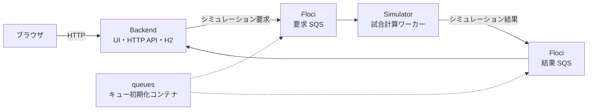
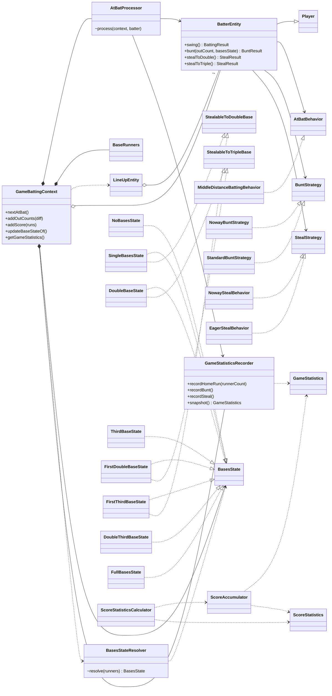

# Baseball Orders

## アプリケーション概要

Baseball Orders は、打者の能力と打順を設定し、試合シミュレーションの結果を確認できるアプリケーションです。
ブラウザから受け付けたシミュレーション要求を SQS 互換のメッセージキューへ送り、独立した Simulator が
試合を計算します。計算結果は同じメッセージキューを経由して Backend に戻り、画面へ同期的に返されます。

## 構成図



Docker Compose では、Floci が AWS SQS をローカルで代替します。Backend だけをホストへ公開し、
Simulator・Floci・キュー初期化コンテナは Docker ネットワーク内で通信します。

## Docker を使ったローカル実行

Docker Desktop または Docker Engine と Docker Compose を起動し、リポジトリルートで次を実行します。
ホストに Java や Gradle をインストールする必要はありません。初回はアプリケーションのビルドと
依存ライブラリ・コンテナイメージのダウンロードが行われます。

```sh
docker compose up -d --build --wait --wait-timeout 180
```

起動後、ブラウザで http://127.0.0.1:8080/ を開くと、打者一覧・打順設定・シミュレーションを利用できます。

8080 番ポートが使用中の場合は、公開ポートを変更します。

```sh
BACKEND_PORT=18080 docker compose up -d --build --wait --wait-timeout 180
```

この場合は http://127.0.0.1:18080/ を開いてください。

### 動作確認・停止

```sh
python3 infra/docker/smoke-test.py
docker compose logs --tail=100 backend simulator queues
docker compose down
```

ポートを変更した場合の疎通確認は、同じ環境変数を付けて実行します。

```sh
BACKEND_PORT=18080 python3 infra/docker/smoke-test.py
```

構成、キュー名の変更、トラブルシューティングなどは
[ローカル Docker 環境の詳細](infra/docker/README.md)を参照してください。

## リリースイメージのECR公開

GitHub Releaseを公開すると、BackendとSimulatorのコンテナイメージをビルドし、Amazon ECRへ自動でpushします。
各イメージにはGitHub Releaseのタグと`latest`タグが付きます。

GitHub Environment `aws-production`に、次のVariablesを設定してください。

- `AWS_ECR_ROLE_ARN`: ECRへのpush権限を持ち、GitHub OIDCから引き受け可能なIAMロールARN
- `AWS_REGION`: ECRのAWSリージョン（未設定時は`ap-northeast-1`）
- `ECR_BACKEND_REPOSITORY`: 作成済みのBackend用ECRリポジトリ名
- `ECR_SIMULATOR_REPOSITORY`: 作成済みのSimulator用ECRリポジトリ名

リリースタグはDockerイメージタグとして利用できる形式（例: `v1.2.3`）にしてください。

## Simulator のドメイン設計

`apps/simulator/domain` の主要なドメインクラスと関係を次に示します。図を読みやすくするため、
`BattingResult`、`BuntResult`、`StealResult`、`OutCount`、`Base` などの enum への参照線は省略しています。



`GameBattingContext` は DDD の **集約ルート（Aggregate Root）** であり、試合のイニング、得点、
アウト、走者、打順を一貫した単位として保持します。同時に、利用側へ `nextAtBat()` などの少数の操作を
提供し、内部の協調処理を隠す **Facade** として働きます。

一打席の「盗塁 → バント → 打撃」というユースケースは `AtBatProcessor` へ分離しています。
これはエンティティ単体に属さないルールを表す **Domain Service** です。成功したプレーの計数は
`GameStatisticsRecorder` が **Accumulator** として引き受け、`snapshot()` で不変の
`GameStatistics` を返します。

塁状況ごとの進塁ルールは `BasesState` を中心とした **State パターン** です。
`GameBattingContext` は現在の State へ打撃結果の適用を委譲し、走者配置が変わると
`BasesStateResolver` が対応する State を選びます。この Resolver は生成判断を一か所へ集約する
**Simple Factory** です。

打者の打撃、バント、盗塁の判断は、それぞれ `AtBatBehavior`、`BuntStrategy`、`StealStrategy` を
差し替えられる **Strategy パターン** です。`BatterEntity` は能力値を保持しながら判断アルゴリズムを
Strategy へ委譲するため、選手モデルを変えずに戦術を追加できます。

集計側では `ScoreStatisticsCalculator` が計算手順を担い、`ScoreAccumulator` が複数試合を一度の走査で
集約します。公開結果の `GameStatistics` と `ScoreStatistics` は不変の **Value Object** として、
シミュレーション中の可変状態を外部へ漏らしません。
