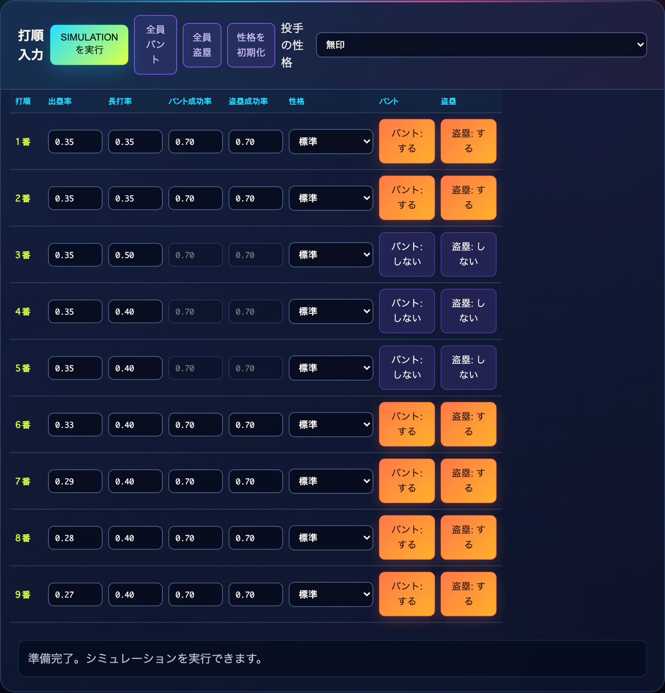
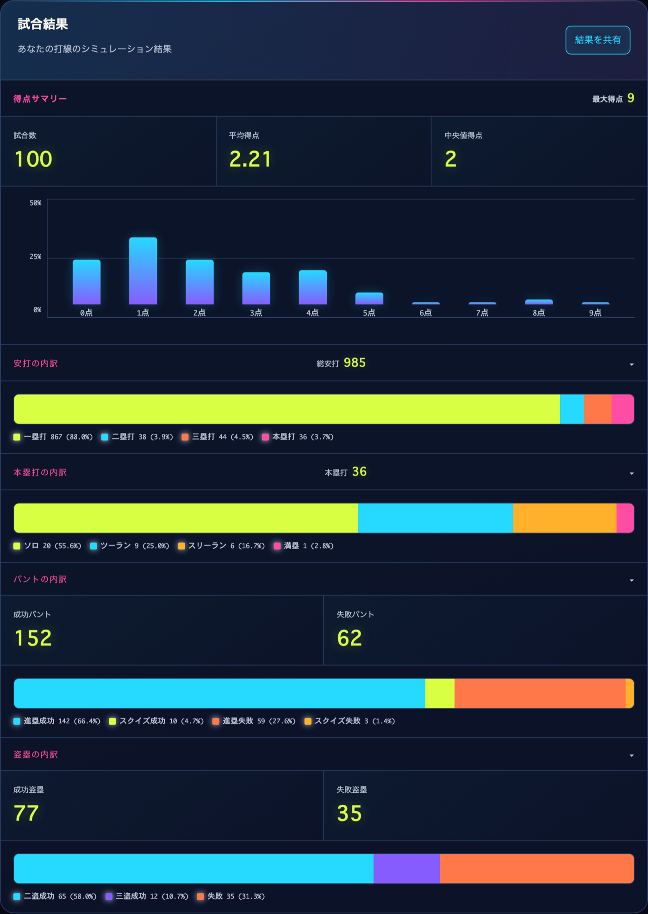
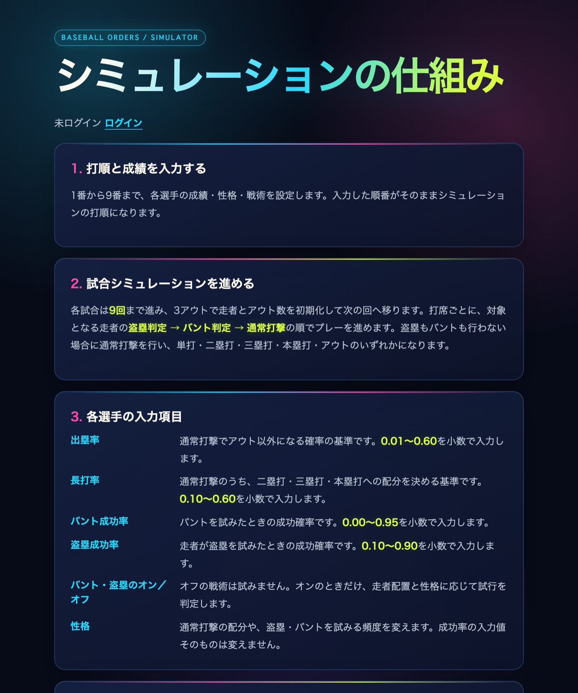
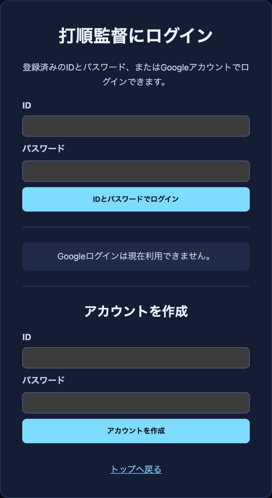
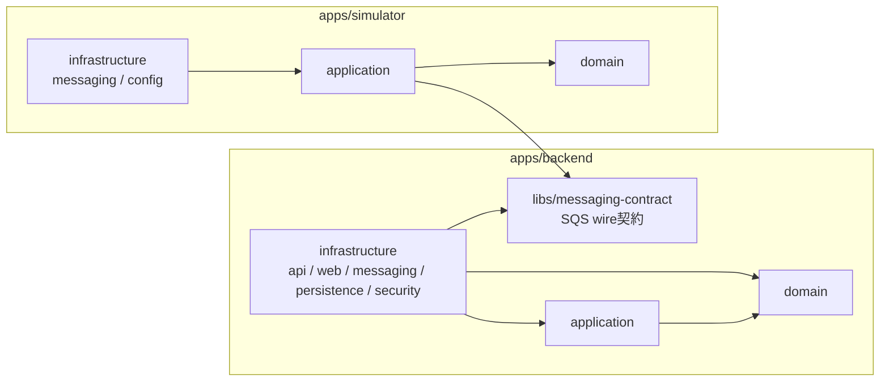
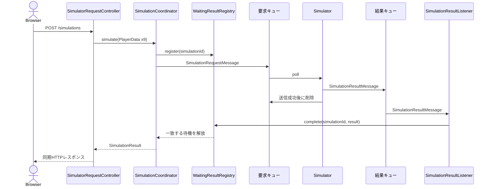
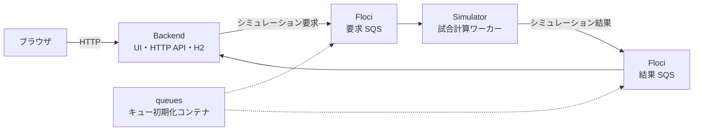

# Baseball Orders（打順監督）

## アプリケーション概要

Baseball Orders は、打者の能力と打順を設定し、試合シミュレーションの結果を確認できるアプリケーションです。
ブラウザから受け付けたシミュレーション要求を SQS 互換のメッセージキューへ送り、独立した Simulator が
試合を計算します。計算結果は同じメッセージキューを経由して Backend に戻り、画面へ同期的に返されます。

9人分の打者能力（出塁率・長打率・バント成功率・盗塁成功率）、各打者の性格、バント・盗塁の可否、
対戦する投手の性格を入力すると、既定で100試合を試行し、得点分布・安打内訳・本塁打内訳・バント/盗塁の
成否を集計して返します。

[Simulatorの詳細](apps/simulator/README.md)を参照してください。

## 画面イメージ

### 打順入力

1番から9番までの能力値・性格・戦術を1画面で設定します。入力値は画面側で範囲と桁数を検証し、
打線全体の平均出塁率・平均長打率の上限を満たすまで実行ボタンを無効にします。



### 試合結果

100試合の集計を、得点サマリー・得点分布ヒストグラム・安打内訳・本塁打内訳・バント内訳・盗塁内訳として
表示します。内訳は積み上げバーと凡例で構成比を示します。



### シミュレーションの仕組み

利用者向けにシミュレーションの進行規則と入力項目の意味を説明する静的ページです。



### ログイン / アカウント作成

ID・パスワードによるフォームログインと、Google アカウントによる OIDC ログインに対応します。
Google ログインの設定がない環境では、その導線のみを無効化して表示します。



## 技術スタック

| 領域 | 採用技術 |
| --- | --- |
| 言語・ビルド | Java 25、Gradle composite build（`includeBuild`）、Spotless（google-java-format AOSP） |
| Backend | Spring Boot 4.0.0、Spring MVC、Thymeleaf、Spring Security（フォームログイン / OAuth2 Client）、Spring Data JPA、Flyway、H2、Spring Cloud AWS SQS |
| Simulator | Spring Framework 7.0.1（Spring Boot の Web スタックなし）、AWS SDK for Java v2 (SQS)、Jackson |
| コード生成 | Lombok（`@Getter` / `@RequiredArgsConstructor` / `@Slf4j`）、Jilt（STAGED Builder） |
| テスト | JUnit 6.0.1、Mockito、ArchUnit、ElasticMQ、JaCoCo |
| 実行基盤 | Docker Compose（Floci を SQS 互換として使用）、Terraform（Amazon SQS）、GitHub Actions（テスト / ECR push / デプロイ） |

## 実装方針

### 設計の狙い

「同期的な画面操作」と「非同期な計算処理」を、1つのアプリケーションに押し込めずに分離することを主眼に置いています。
UI を持つ Backend と、試合規則だけを持つ Simulator を独立したデプロイ単位とし、両者はメッセージキュー経由でのみ
つながります。互いのクラスには一切依存せず、共有するのは `libs/messaging-contract` の wire 型だけです。

### プロジェクト構成

```text
baseball-orders/
├── apps/
│   ├── backend/                  # 同期HTTP API・Thymeleaf UI・永続化・SQSアダプタ
│   │   ├── domain/               # 業務データと結果モデル（フレームワーク非依存）
│   │   ├── application/          # ユースケース調整・ポート定義・結果待機
│   │   └── infrastructure/       # api / web / messaging / persistence / security
│   └── simulator/                # 非同期の試合計算ワーカー
│       ├── domain/               # 試合規則（game / player / play / statistics）
│       ├── application/          # シミュレーションユースケース
│       └── infrastructure/       # SQSポーリング・シリアライズ・wireマッピング
├── libs/messaging-contract/      # SQSのwire契約（両アプリが物理的に共有）
├── integration-test/             # backend -> SQS -> simulator -> SQS -> backend の疎通検証
├── infra/
│   ├── docker/                   # ローカル実行環境
│   └── aws-terraform/            # AWSメッセージングリソース
└── docs/                         # アーキテクチャマップ・機能仕様
```

ルートは composite build です。`apps/backend` と `apps/simulator` はそれぞれ独立した Gradle ビルドで、
`libs/messaging-contract` だけを同一ディレクトリとして両方が `include` します。

### レイヤと依存方向

各アプリケーション内部の依存は `infrastructure -> application -> domain` の一方向に固定します。
domain にはフレームワーク・Thymeleaf・SQS・HTTP・永続化の型を持ち込みません。



Backend の `infrastructure` では、`api` / `web` / `messaging` / `persistence` の各アダプタが互いを直接参照することを
禁じ、必ず `application` のユースケースかポートを経由させます。この制約は ArchUnit テストで機械的に検証しています。

### 同期HTTP と非同期SQS の橋渡し

画面は「実行して結果が返る」同期操作ですが、計算は別プロセスで非同期に走ります。両者は相関IDで対応付けます。

1. `SimulatorRequestController` が9人分の入力を受け取り、`SimulationCoordinator` に委譲する。
2. Coordinator が `simulationId`（UUID）を採番し、`WaitingResultRegistry` に待機を登録してから要求をキューへ送る。
3. Simulator が要求を取り出し、試合を計算して結果キューへ送る。**結果の送信に成功してから要求メッセージを削除する**ため、
   途中で落ちた要求は再配信される。
4. `SimulationResultListener` が結果を受け取り、`simulationId` が一致する待機を解放する。
5. Coordinator が最大30秒まで待機し、HTTP レスポンスとして返す。相関しない結果や時間切れ後の結果は破棄する。



### ドメインモデルの設計

Simulator の domain 層は、条件分岐の塊になりがちな野球の規則を型で表現することを優先しています。

- **塁状態**: 走者配置を `BasesState` の8つの具象 State（無走者・一塁・二塁・三塁・一二塁・一三塁・二三塁・満塁）として表し、
  安打や進塁ごとの遷移を State 自身に持たせます。共通の遷移機構は `AbstractBasesState` に置きます。
- **能力インターフェース**: 「この塁状況では盗塁できる／スクイズできる」といった可否を `Stealable`、`Buntable`、
  `SqueezeBuntable` などの sealed インターフェースで表現し、状態と作戦の組み合わせを型で絞り込みます。
- **打者の行動**: 打撃・バント・盗塁の判断を sealed な `HittingStrategy` / `BuntStrategy` / `StealStrategy` の
  3系統に分け、`BatterEntity` は判断を Strategy に委譲します。性格（標準・ブンブン丸・盗塁重視・バント重視）は
  Strategy の組み合わせとして表現します。
- **統計**: `GameStatisticsRecorder` が1試合内のプレーを観測し、`ScoreAccumulator` が完了した試合を1回の走査で
  すべてのカウンタに集約します。集計項目ごとに Stream を張り直して同じコレクションを何度も走査することは避けています。

enum の分岐は `switch` 式で全定数を明示し、`default` を置かないことで、定数追加時にコンパイルエラーとして
検出されるようにしています。値オブジェクトは Jilt の STAGED Builder で生成し、必須項目の指定漏れをコンパイル時に防ぎます。

詳細なクラス構成は [Simulator domain class design](apps/simulator/README.md) を参照してください。

### 品質の担保

「レビューで気をつける」ではなく、壊れたら落ちる仕組みに寄せています。

- **ArchUnit**: レイヤの依存方向、domain の技術非依存、`infrastructure` アダプタ間の直接参照禁止を検証します。
- **結合テスト**: `integration-test` が backend -> SQS -> simulator -> SQS -> backend の往復を実際に通します。
  各結合テストには「実物 / モック / 担保する疎通 / 担保しないもの」を日本語で明記する規約を設けています。
- **ElasticMQ**: SQS アダプタは実際のキュー実装に対して検証します。
- **JaCoCo**: メッセージ処理の中核である `SqsSimulationScheduler` に、行・分岐カバレッジ100%を強制します。
- **Spotless**: google-java-format (AOSP) を `test` タスクの前提として実行し、整形差分を CI で落とします。
- **Terraform**: `fmt -check` / `validate` / `test` を CI で実行します。

検証はすべて `./.agents/skills/baseball-orders-development/scripts/verify.sh` に集約しています。

```sh
./.agents/skills/baseball-orders-development/scripts/verify.sh            # backend と simulator
./.agents/skills/baseball-orders-development/scripts/verify.sh backend    # backend のみ
./.agents/skills/baseball-orders-development/scripts/verify.sh terraform  # Terraform のみ
```

### 設定方針

試合数やポーリング間隔などの調整可能な数値は、コード内のリテラルではなく名前付きプロパティとして持ち、
local / dev / prod のプロファイルごとに値を定義します（例: `SIMULATION_GAME_COUNT`、既定100試合）。
一方、9回・3アウトのような固定規則を表す数値はコード側に残します。

## 構成図



Docker Compose では、Floci が AWS SQS をローカルで代替します。Backend だけをホストへ公開し、
Simulator・Floci・キュー初期化コンテナは Docker ネットワーク内で通信します。

## Docker を使ったローカル実行

Docker Desktop または Docker Engine と Docker Compose を起動し、リポジトリルートで次を実行します。
ホストに Java や Gradle をインストールする必要はありません。初回はアプリケーションのビルドと
依存ライブラリ・コンテナイメージのダウンロードが行われます。

```sh
docker compose up -d --build --wait --wait-timeout 180
```

起動後、ブラウザで http://127.0.0.1:8080/ を開くと、打者一覧・打順設定・シミュレーションを利用できます。

8080 番ポートが使用中の場合は、公開ポートを変更します。

```sh
BACKEND_PORT=18080 docker compose up -d --build --wait --wait-timeout 180
```

この場合は http://127.0.0.1:18080/ を開いてください。

### 動作確認・停止

```sh
python3 infra/docker/smoke-test.py
docker compose logs --tail=100 backend simulator queues
docker compose down
```

ポートを変更した場合の疎通確認は、同じ環境変数を付けて実行します。

```sh
BACKEND_PORT=18080 python3 infra/docker/smoke-test.py
```

構成、キュー名の変更、トラブルシューティングなどは
[ローカル Docker 環境の詳細](infra/docker/README.md)を参照してください。

## リリースイメージのECR公開

GitHub Releaseを公開すると、BackendとSimulatorのコンテナイメージをビルドし、Amazon ECRへ自動でpushします。
各イメージにはGitHub Releaseのタグと`latest`タグが付きます。

GitHub Environment `aws-production`に、次のVariablesを設定してください。

- `AWS_ECR_ROLE_ARN`: ECRへのpush権限を持ち、GitHub OIDCから引き受け可能なIAMロールARN
- `AWS_REGION`: ECRのAWSリージョン（未設定時は`ap-northeast-1`）
- `ECR_BACKEND_REPOSITORY`: 作成済みのBackend用ECRリポジトリ名
- `ECR_SIMULATOR_REPOSITORY`: 作成済みのSimulator用ECRリポジトリ名

リリースタグはDockerイメージタグとして利用できる形式（例: `v1.2.3`）にしてください。