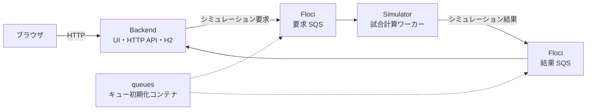

# Baseball Orders

## アプリケーション概要

Baseball Orders は、打者の能力と打順を設定し、試合シミュレーションの結果を確認できるアプリケーションです。
ブラウザから受け付けたシミュレーション要求を SQS 互換のメッセージキューへ送り、独立した Simulator が
試合を計算します。計算結果は同じメッセージキューを経由して Backend に戻り、画面へ同期的に返されます。

## 構成図



Docker Compose では、Floci が AWS SQS をローカルで代替します。Backend だけをホストへ公開し、
Simulator・Floci・キュー初期化コンテナは Docker ネットワーク内で通信します。

## Docker を使ったローカル実行

Docker Desktop または Docker Engine と Docker Compose を起動し、リポジトリルートで次を実行します。
ホストに Java や Gradle をインストールする必要はありません。初回はアプリケーションのビルドと
依存ライブラリ・コンテナイメージのダウンロードが行われます。

```sh
docker compose up -d --build --wait --wait-timeout 180
```

起動後、ブラウザで http://127.0.0.1:8080/ を開くと、打者一覧・打順設定・シミュレーションを利用できます。

8080 番ポートが使用中の場合は、公開ポートを変更します。

```sh
BACKEND_PORT=18080 docker compose up -d --build --wait --wait-timeout 180
```

この場合は http://127.0.0.1:18080/ を開いてください。

### 動作確認・停止

```sh
python3 infra/docker/smoke-test.py
docker compose logs --tail=100 backend simulator queues
docker compose down
```

ポートを変更した場合の疎通確認は、同じ環境変数を付けて実行します。

```sh
BACKEND_PORT=18080 python3 infra/docker/smoke-test.py
```

構成、キュー名の変更、トラブルシューティングなどは
[ローカル Docker 環境の詳細](infra/docker/README.md)を参照してください。
