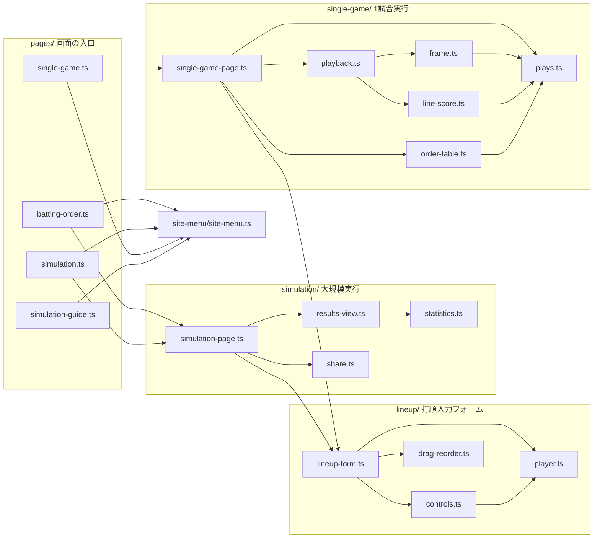
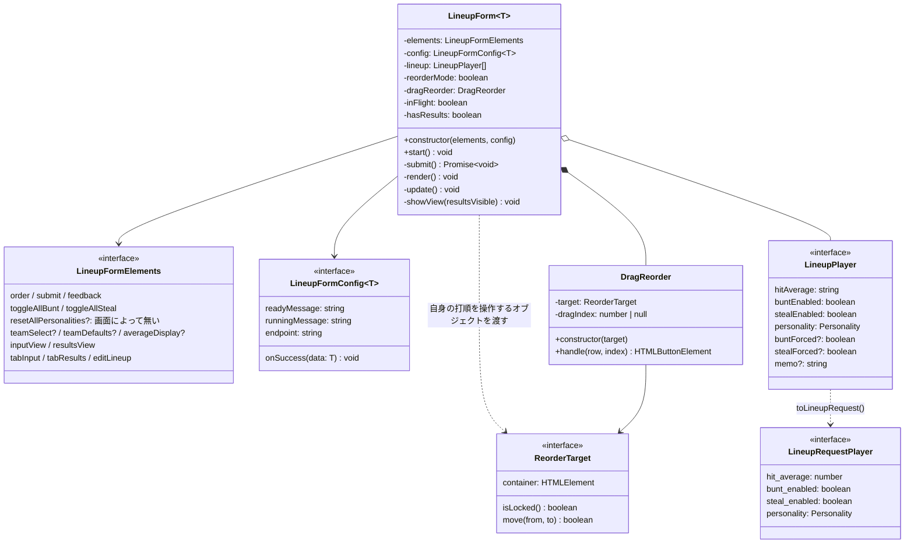
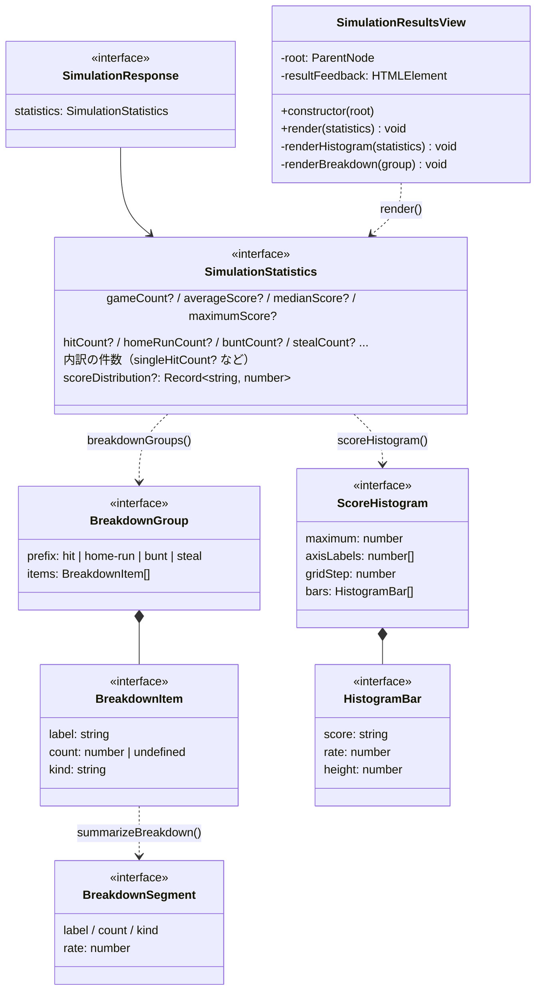
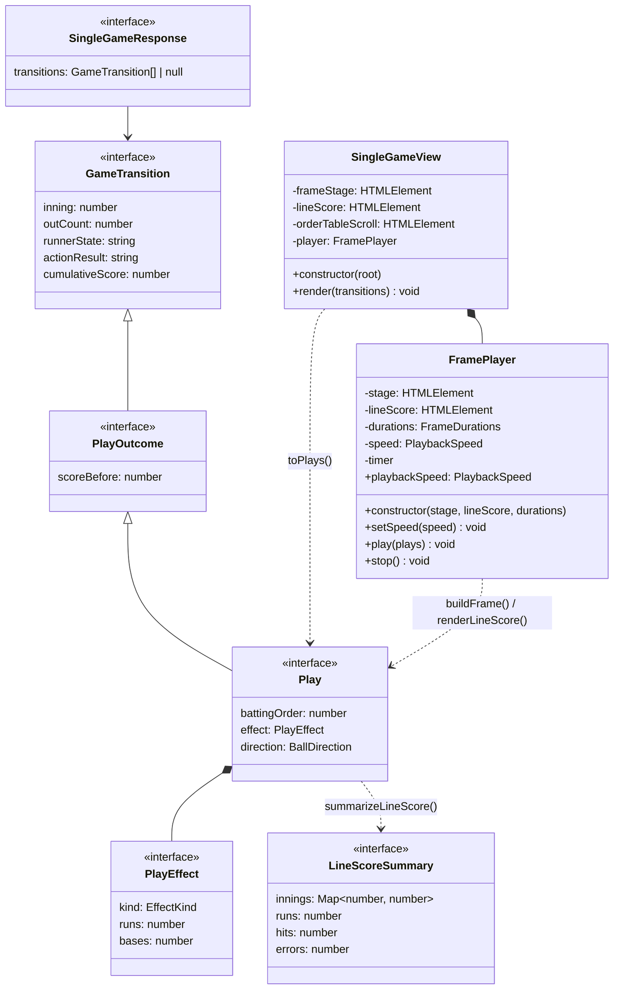

# Backend infrastructure

- [ローカル起動](#dockerでbackendだけを起動する)
- [ログイン](#ログイン)
- [画面スクリプト（TypeScript）の設計](#画面スクリプトtypescriptの設計)

## DockerでBackendだけを起動する

Docker Desktop / Docker EngineとDocker Composeを起動し、`apps/backend` で実行します。
JavaとGradleはDocker内で用意されるため、ホストへのインストールは不要です。

```sh
docker compose -f infrastructure/compose-backend.yaml up -d --build --wait --wait-timeout 180
```

http://127.0.0.1:8080/ を開いてください。8080が使用中の場合は、`BACKEND_PORT=18080` を
コマンドの前に付け、http://127.0.0.1:18080/ を開きます。

この構成はBackendコンテナだけを起動し、`local` プロファイルによりSQSリスナーを停止します。
各画面と打順入力を確認できますが、SimulatorとSQSを起動しないため、シミュレーション実行はできません。
シミュレーションを含めて動かす場合は、[ローカルDocker環境](../../../infra/docker/README.md)を使用してください。

停止するには、次を実行します。

```sh
docker compose -f infrastructure/compose-backend.yaml down
```

Backend・Simulator・FlociをまとめてDockerで動かす場合は、
[ローカルDocker環境](../../../infra/docker/README.md)を参照してください。

AWS 接続なしで各画面と打順入力を確認する場合、`apps/backend` で実行します。

```sh
./gradlew :infrastructure:bootRun
```

http://localhost:8080/ を開いてください。

プロファイル未指定（IDE からの `BackendApplication.main` 実行を含む）では `local` が使われ、SQS リスナーの自動起動を停止します。
シミュレーションの実行には SQS と simulator が必要です。 AWS を使う場合は `SPRING_PROFILES_ACTIVE=aws` を明示し、AWS
認証情報とキューを設定してください。 キュー名は `SIMULATION_REQUEST_QUEUE_NAME` と `SIMULATION_RESULT_QUEUE_NAME`
で指定できます。

## ログイン

ログイン機能はありません。すべての画面（`/`、`/large-scale`、`/single-game`、`/simulation-guide`）と
`POST /simulations`・`POST /simulations/single-game` はログインなしで利用できます。

## 画面スクリプト（TypeScript）の設計

Thymeleaf 画面のスクリプトは `src/main/typescript` に TypeScript の ES module として書きます。
`./gradlew :infrastructure:compileTypeScript` が `tsc` で `build/generated/typescript/static/js` へ出力し、
`/js/**/*.js` として配信します。バンドラーは使いません。import は `./player.ts` のように `.ts` で書き、
`tsc` が出力時に `.js` へ書き換えます（`tsconfig.json` の `rewriteRelativeImportExtensions`）。

### 設計の方針

- **画面ごとの入口は1つ。** 各テンプレートは `pages/<テンプレート名>.ts` だけを
  `<script src="/js/pages/<テンプレート名>.js" type="module">` で読み込みます。
- **読み込んだだけでは画面を操作しない。** 画面を組み立てるのは `pages/` の入口だけです。
  ほかのモジュールは、関数・クラス・型・定数を公開するだけにします（`src/test/js/scripts/sources.test.mjs` で検査）。
- **値の計算とDOMの描画を分ける。** `lineup/player.ts`・`simulation/statistics.ts`・`single-game/plays.ts` は
  DOM に依存しない純粋な関数で、API の応答や入力値を画面に描く値へ変換します。描画するモジュールは、
  その結果を要素にするだけにします。
- **要素は外から渡す。** クラスは `document` を直接探さず、コンストラクタで要素（または探す範囲の `root`）を受け取ります。
  テンプレートに必ずある要素は `requireElement` で取得し、無ければ起動時に例外にします。
- **状態はクラスに閉じ込める。** 打順（`LineupForm`）、ドラッグ中の打順（`DragReorder`）、再生中のタイマーと速度
  （`FramePlayer`）だけが状態を持ちます。モジュールのトップレベルに可変な状態は置きません。
- **TypeScript は型注釈を取り除くだけで JavaScript になる構文に限る**（`erasableSyntaxOnly`）。
  `enum`・`namespace`・コンストラクタ引数のプロパティ宣言は使いません。Node のテストが `.ts` をそのまま import できます。

### 採用したモダンな TypeScript の実装方針

TypeScript 7 と Node 24 を前提に、「型を取り除けばそのまま動く標準の JavaScript を書く」方針を取っています。
型は検査のためだけに使い、ビルド時の変換（バンドル・ダウンレベル変換・型による実行時の振る舞い）に頼りません。

#### ビルドとモジュール

| 方針 | 設定・書き方 | 理由 |
| --- | --- | --- |
| ブラウザ標準の ES module をそのまま配信する | `"module": "es2022"`、テンプレートは `<script type="module">` | バンドラーを使わず、`tsc` の出力をそのまま静的リソースにできる。読み込みは deferred になり、モジュールは1回だけ評価される |
| import は `.ts` の拡張子付きで書く | `import { toPlays } from './plays.ts'` と `"rewriteRelativeImportExtensions": true` | 同じソースを、ブラウザ向けには `tsc` が `.js` へ書き換えて出力し、Node のテストはそのまま import できる |
| 型を取り除くだけで JavaScript になる構文に限る | `"erasableSyntaxOnly": true` | Node 24 の型の除去（type stripping）でテストが `.ts` を直接実行できる。`enum`・`namespace`・コンストラクタ引数のプロパティ宣言は使えない |
| 型だけの import を明示する | `"verbatimModuleSyntax": true`、`import type { Play } from './plays.ts'`、`import { toPlays, type GameTransition } ...` | 型を取り除いたときに、出力に残る import が書いたとおりになる |
| 新しい構文を変換せずに出力する | `"target": "es2022"`、`"lib": ["es2023", "dom", "dom.iterable"]` | クラスフィールド・`?.`・`??`・`async`/`await` などを、対応ブラウザ向けにそのまま出力する |
| 型エラーがあれば JavaScript を出力しない | `"noEmitOnError": true` | 型エラーのあるスクリプトを配信しない |

#### 型の厳密さ

| 方針 | 設定・書き方 |
| --- | --- |
| 厳格な型検査と、未使用・暗黙の戻り値・switch のフォールスルーの検出 | `"strict": true`、`noUnusedLocals`、`noUnusedParameters`、`noImplicitReturns`、`noFallthroughCasesInSwitch` |
| `any` と非 null アサーション（`!`）を使わない | テンプレートの要素は `requireElement()` で存在を確かめてから型付きで返す。省略できる要素は `T \| null` として `?.` で扱う |
| 外部から来る値は `unknown` で受ける | API の応答は `const data: unknown = await response.json()` で受け、使う場所で型を決める |
| 変更しない値は `readonly` にする | 引数の配列は `readonly Play[]`、クラスの依存は `private readonly` |

#### `enum` の代わりに文字列リテラルのユニオン型を使う

`Personality`・`EffectKind`・`PlaybackSpeed`・`BallDirection` は、`enum` ではなく文字列リテラルのユニオン型です。
API の JSON やテンプレートの data 属性の文字列をそのまま扱え、型を取り除いても実行時のオブジェクトが増えません。
すべての値を扱っているかどうかは、コンパイラが検査します。

```ts
export type EffectKind = 'none' | 'hit' | 'score' | 'home-run' | 'bunt';

// default を書かない switch。EffectKind に値を足すと、扱っていない値の経路に return が無いため TS2366 でコンパイルエラーになる。
export function effectHeadline(effect: PlayEffect): string {
  switch (effect.kind) {
    case 'home-run': return effect.runs === GRAND_SLAM_RUNS ? 'GRAND SLAM!' : 'HOME RUN!';
    // ...
    case 'none': return '';
  }
}

// Record<ユニオン型, …> は、すべてのキーが揃っていないとエラーになる（readFrameDurations() の戻り値で TS2741）。
export type FrameDurations = Record<EffectKind, number>;
```

#### `as const` と `satisfies` で、値から型を導きつつ形を検査する

定数は `as const` でリテラル型のまま保ち、`satisfies` で期待する形に合っているかだけを検査します。
型注釈（`: Record<…>`）と違って値の型を広げないため、キーの並びやリテラル値をそのまま使えます。

```ts
export const PERSONALITY_LABELS = {
  DEFAULT: '単打マン',
  // ...
} as const satisfies Record<Personality, string>; // 性格の追加漏れはエラー、キーの並びは選択肢の並びとして使う

export const SUMMARY_KEYS = ['gameCount', /* ... */] as const satisfies readonly (keyof SimulationStatistics)[];
export function summaryElementId(key: (typeof SUMMARY_KEYS)[number]): string { /* ... */ } // 配列の要素からユニオン型を導く
```

#### ジェネリクスとユーティリティ型で、必要な分だけを型にする

| 書き方 | 例 | 効果 |
| --- | --- | --- |
| 応答の型を外から決めるクラス | `LineupForm<T>` と `LineupFormConfig<T>.onSuccess(data: T)` | 共通フォームが画面ごとの応答型（`SimulationResponse`・`SingleGameResponse`）を知らずに済む |
| タグ名から要素の型を決める | `createElement<K extends keyof HTMLElementTagNameMap>(tag: K)` | `createElement('input')` が `HTMLInputElement` を返す |
| 取得する要素の型を呼び出し側で決める | `requireElement<HTMLButtonElement>('#share-results')` | キャストせずに型付きの要素を得る |
| 使うプロパティだけを要求する | `isValidPlayer(player: Pick<LineupPlayer, 'hitAverage'>)`、`summarizeLineScore(plays: readonly Pick<Play, 'inning' \| 'effect'>[])` | テストや別の呼び出し元が、必要な値だけを持つオブジェクトを渡せる |
| 入力の型を保ったまま情報を足す | `annotateBattingOrder<T extends Pick<GameTransition, 'actionResult'>>(…): (T & { battingOrder: number })[]` | 推移の段階（`PlayOutcome` など）を失わずに打順を付ける |
| インターフェースの継承で段階を表す | `GameTransition` → `PlayOutcome` → `Play` | 「API の値」「プレー直後に直した値」「再生用の値」を型で区別する |
| 型を関数の型から導く | `ReturnType<typeof setTimeout>` | タイマーIDの型を実装に書き込まない。実行時の値はブラウザでは数値、Node のテストではオブジェクトだが、`clearTimeout()` に渡すだけなのでどちらでも動く |

#### クラスと関数の使い分け

- 状態を持たない処理は、エクスポートした関数にします（`toPlays()`・`scoreHistogram()`・`buildFrame()` など）。
- 状態や DOM の要素を持ち続けるものだけをクラスにします（`LineupForm`・`DragReorder`・`FramePlayer`・`SimulationResultsView`・`SingleGameView`）。
  フィールドはクラスフィールド宣言と `private readonly` で書き、コンストラクタで代入します（`erasableSyntaxOnly` のため、
  コンストラクタ引数のプロパティ宣言は使いません）。
- クラスどうしは、相手のクラスではなく必要な操作だけのインターフェースでつなぎます。
  `DragReorder` は `LineupForm` を知らず、`ReorderTarget`（`container`・`isLocked()`・`move()`）だけを受け取ります。

#### 採用していないもの・制約

- **ES の `#private` は使っていません。** 非公開のメンバーは TypeScript の `private` 修飾子で、型検査の時点だけで守っています。
- **API の応答は実行時に検証していません。** `unknown` で受けたあと、`data as T` で型を決めています。
  応答の形は、同じ backend の HTTP API（`infrastructure/api`）が返す JSON に合わせる前提です。エラー応答も
  `data as ErrorResponse` で読んでいます。同様に、テンプレートの data 属性や `<select>` の値も `as Personality`・
  `as PlaybackSpeed` で型を決めています（`as` による型の断定はこの5か所だけです）。
- **バンドル・圧縮はしていません。** モジュールごとに配信するため、ブラウザは import を辿って複数のファイルを取得します。

### モジュールの依存関係

矢印は「import する」向きです。`shared/dom.ts` はほぼすべてのモジュールが使うため省略しています。



| テンプレート | 入口 | 組み立てる処理 |
| --- | --- | --- |
| `batting-order.html`（`/`） | `pages/batting-order.ts` | `startSimulationPage()`（組み替えモード）、`initSiteMenu()` |
| `simulation.html`（`/large-scale`） | `pages/simulation.ts` | `startSimulationPage()`、`initSiteMenu()` |
| `single-game.html`（`/single-game`） | `pages/single-game.ts` | `startSingleGamePage()`、`initSiteMenu()` |
| `simulation-guide.html`（`/simulation-guide`） | `pages/simulation-guide.ts` | `initSiteMenu()` |

打順組み替え画面と大規模実行画面は同じ `startSimulationPage()` を使います。
`#order` に `data-lineup-mode="reorder"` があると、`LineupForm` が組み替えモードになります。

### lineup/ 打順入力フォーム

3画面で共通の打順入力です。画面ごとに違う文言・送信先・結果の描画は `LineupFormConfig` で受け取ります。



| モジュール | 公開するもの | 役割 |
| --- | --- | --- |
| `player.ts` | `Personality`、`LineupPlayer`、`LineupRequestPlayer`、`PERSONALITY_LABELS`、`HIT_AVERAGE_RANGE`、`MEMO_MAX_LENGTH`、`createInitialLineup()`、`isValidPlayer()`、`isValidLineup()`、`averageHitAverage()`、`withLeadingZero()`、`formatHitAverage()`、`toLineupRequest()`、`parseDefaultBatters()`、`movePlayer()` | 打者の値・初期打順・打率の検証と整形・API 送信形式への変換。DOM に依存しない |
| `controls.ts` | `toggleButton()`、`forcedLabel()`、`fieldWrapper()`、`statLabel()`、`hitAverageInput()`、`personalitySelect()`、`memoInput()` | 1行分の入力部品を作る。状態は持たず、変更はコールバックで呼び出し元へ伝える |
| `drag-reorder.ts` | `ReorderTarget`、`DragReorder` | ポインター操作と上下キーで打者を入れ替える。打順そのものは `ReorderTarget.move()` に任せる |
| `lineup-form.ts` | `LineupFormElements`、`LineupFormConfig<T>`、`findLineupFormElements()`、`LineupForm<T>` | 打順の状態、入力画面と結果画面の切り替え、一括切り替え、API への POST |

`LineupForm` は打順を変えるたびに `render()` で行を作り直し、`update()` で操作の有効・無効と案内文を更新します。
入力欄の入力中は再描画せず、`update()` だけを呼びます（入力中のフォーカスを失わないため）。
`T` は API の応答の型で、`onSuccess` がそのまま受け取ります。

### simulation/ 大規模実行



| モジュール | 公開するもの | 役割 |
| --- | --- | --- |
| `statistics.ts` | `SimulationStatistics`、`SimulationResponse`、`SUMMARY_KEYS`、`summaryElementId()`、`BreakdownItem`、`BreakdownGroup`、`breakdownGroups()`、`BreakdownSegment`、`summarizeBreakdown()`、`HISTOGRAM_STEP_PERCENT`、`HistogramBar`、`ScoreHistogram`、`scoreHistogram()` | 集計値を、内訳の割合や得点分布の目盛りに変換する。DOM に依存しない |
| `results-view.ts` | `SimulationResultsView` | 結果パネルへ集計値・得点分布・内訳を描く。要素 ID は `summaryElementId()` と `BreakdownGroup.prefix` から決める |
| `share.ts` | `shareText()`、`bindShareButton()` | 表示中の結果をネイティブ共有、または非対応ならクリップボードへコピーする |
| `simulation-page.ts` | `startSimulationPage()` | `LineupForm<SimulationResponse>` を `/simulations` へ送る設定で開始し、成功時に `SimulationResultsView.render()` を呼ぶ |

### single-game/ 1試合実行

API の状況推移（`GameTransition`）をプレー直後の状況（`PlayOutcome`）に直し、打順と演出を付けた
再生用のプレー（`Play`）にしてから描画します。



| モジュール | 公開するもの | 役割 |
| --- | --- | --- |
| `plays.ts` | `GameTransition`、`SingleGameResponse`、`EffectKind`、`PlayEffect`、`PlayOutcome`、`Play`、`BallDirection`、`BATTING_ORDER_SIZE`、`OUTS_PER_INNING`、`isStealOnly()`、`resolvePlayOutcomes()`、`annotateBattingOrder()`、`classifyEffect()`、`toPlays()` | 推移をプレーに変換し、打順・演出（本塁打・得点・安打・バント・通常）を決める。DOM に依存しない |
| `frame.ts` | `RUNNER_LAYOUT`、`effectHeadline()`、`outCountMarks()`、`buildFrame()` | 1プレーのアニメーションフレームを作る。乱数を使わず、同じプレーなら同じフレームにする |
| `line-score.ts` | `LineScoreSummary`、`REGULATION_INNINGS`、`summarizeLineScore()`、`lineScoreInningCount()`、`buildLineScore()`、`renderLineScore()` | イニング別得点と R・H・E のスコアボード。試合全体を表示し、再生中のイニングを強調する |
| `order-table.ts` | `buildOrderTable()` | 打順×イニングの打席結果表。盗塁だけの推移は含めない |
| `playback.ts` | `PlaybackSpeed`、`PLAYBACK_SPEED_MULTIPLIERS`、`FrameDurations`、`readFrameDurations()`、`FramePlayer`、`bindPlaybackSpeedOptions()` | フレームのコマ送り再生。表示時間はサーバー設定（`#frame-stage` の data 属性）×再生速度の倍率 |
| `single-game-page.ts` | `SingleGameView`、`startSingleGamePage()` | 結果パネルの組み立てと、`LineupForm<SingleGameResponse>` を `/simulations/single-game` へ送る設定で開始する |

### site-menu/・shared/

| モジュール | 公開するもの | 役割 |
| --- | --- | --- |
| `site-menu/site-menu.ts` | `initSiteMenu()` | 左メニューをメニューボタン・閉じるボタン・メニュー外のクリック・Escape で開閉する |
| `shared/dom.ts` | `requireElement()`、`optionalElement()`、`createElement()`、`emptyState()` | 要素の取得と生成。`requireElement()` は要素が無ければ例外にする |

### 新しい処理を追加するとき

- 画面を追加するときは、テンプレートと同じ名前の `pages/<テンプレート名>.ts` を作り、テンプレートの末尾で
  1つだけ読み込みます（`src/test/js/scripts/pages.test.mjs` が対応を検査します）。
- API の応答や入力値を加工する処理は、DOM に依存しない関数として `player.ts`・`statistics.ts`・`plays.ts`
  （またはそれに相当する新しいモジュール）に置き、描画するモジュールからは呼び出すだけにします。
- 調整したい数値（フレーム表示時間など）はサーバー設定から data 属性で渡し、スクリプトに直接書きません。
  打順の人数・アウト数・9回のような試合のルールは、名前付きの定数にします。

### テスト

| 場所 | 対象 | 方法 |
| --- | --- | --- |
| `src/test/js/scripts/<機能>/*.test.mjs` | 各モジュールの振る舞い | `.ts` を直接 import し、DOM は jsdom で検査する（`support/dom.mjs` が実テンプレートを読み込む） |
| `src/test/js/scripts/pages.test.mjs` | 画面の入口 | テンプレートが読み込む入口と、実テンプレートのDOMで入口が起動できること |
| `src/test/js/scripts/sources.test.mjs` | ソース全体 | 廃止した項目や乱数が残っていないこと、import の書き方、入口以外が読み込み時に画面を操作しないこと |
| `src/test/js/*.test.mjs` | テンプレートと CSS | HTML・CSS の内容を検査する |
| `SimulationPageIntegrationTest` | 配信 | 各画面の入口から import を辿り、すべてのモジュールを JavaScript として取得できること |

`./gradlew :infrastructure:testTypeScript`（`check` に含まれる）で Node のテストをまとめて実行します。
