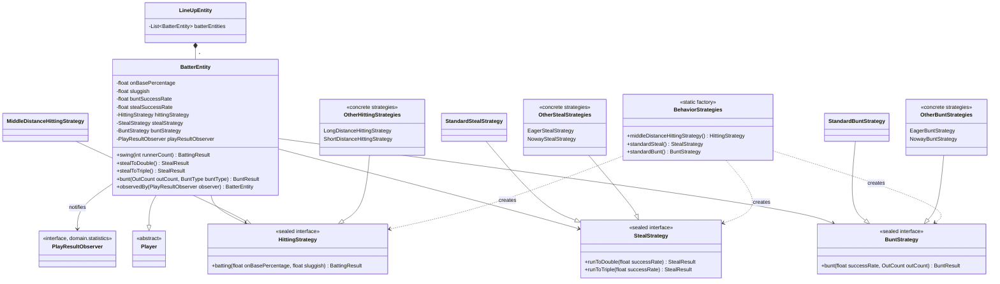
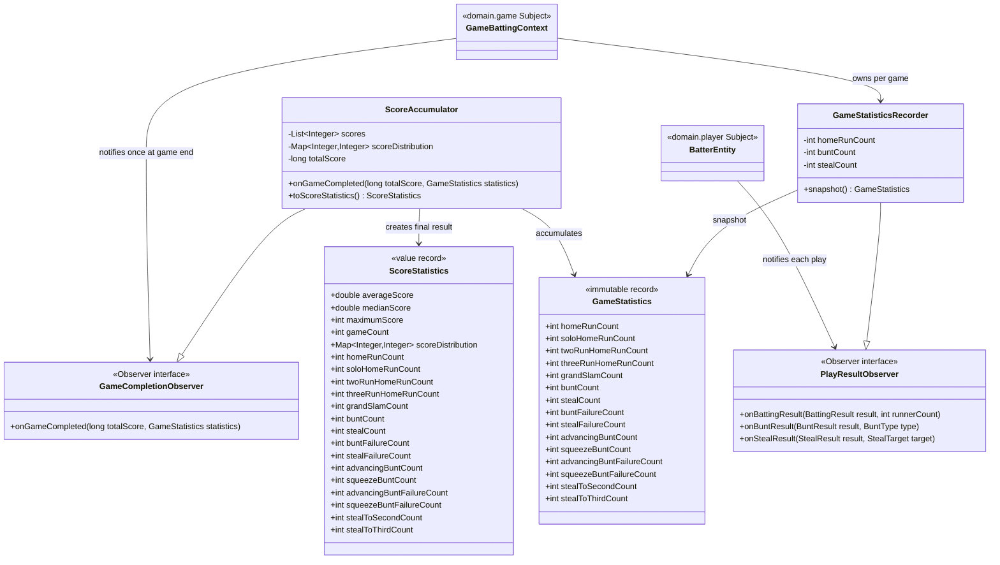

# Simulator domain class design

`simulator` の domain 層は、野球のシミュレーション規則を外部 I/O から独立させたモデルです。この文書では、`domain.game`、`domain.player`、`domain.statistics` の3パッケージを単位に、主要クラスの責務と関係を説明します。

図では同じ役割の具象クラスを代表例へまとめています。矢印の `--|>` は継承またはインターフェース実装、`-->` は利用、`*--` は所有を表します。`domain.play` の enum は3パッケージ間で受け渡すプレー結果なので、関係を理解するために必要な箇所だけ掲載します。

## `domain.game`: 試合進行と塁状態

`GameBattingContext` は試合全体の Context です。イニング、得点、打順と `InningStateContext` を保持し、`AtBatProcessor` に一打席の進行を委譲します。`InningStateContext` は共有する走者・アウト数、現在の `BasesState`、8種類の ConcreteState を保持します。`AtBatProcessor` は「盗塁、バント、打撃」の順に結果を判定し、能力インターフェースまたは現在の State に結果を適用します。バント成功・失敗時は打席を完了して打撃処理へ進まず、State が走者、アウト、得点と次の塁状態を更新します。

```mermaid
classDiagram
    class GameBattingContext {
        -long inning
        -long totalScore
        -InningStateContext inningStateContext
        -GameStatisticsRecorder statisticsRecorder
        -GameCompletionObserver gameCompletionObserver
        -List~BatterEntity~ batterEntityOrders
        -AtBatProcessor atBatProcessor
        +nextAtBat()
        +completeInning()
    }

    class AtBatProcessor {
        ~process(InningStateContext context, BatterEntity batter) boolean
    }

    class InningStateContext {
        -InningState inningState
        -BasesState currentBaseState
        -NoBasesState noBasesState
        -SingleBasesState singleBasesState
        -DoubleBaseState doubleBaseState
        -FirstDoubleBaseState firstDoubleBaseState
        -ThirdBaseState thirdBaseState
        -FirstThirdBaseState firstThirdBaseState
        -DoubleThirdBaseState doubleThirdBaseState
        -FullBasesState fullBasesState
        ~changeState(int configuration)
        ~addOut()
        ~addScore(long runs)
        ~completeInning()
    }

    class BasesState {
        <<interface>>
        +getOutCount() OutCount
        +runnerCount() int
        +out()
        +battingOut()
        +walk(BatterEntity batter)
        +hitSingle(BatterEntity batter)
        +hitDouble(BatterEntity batter)
        +hitTriple(BatterEntity batter)
        +hitHomer()
    }

    class AbstractBasesState {
        <<abstract>>
        #InningStateContext context
        #transition(BatterEntity first, BatterEntity second, BatterEntity third, long runs)
    }

    class NoBasesState
    class SingleBasesState
    class DoubleBaseState
    class FirstDoubleBaseState
    class ThirdBaseState
    class FirstThirdBaseState
    class DoubleThirdBaseState
    class FullBasesState

    class InningState {
        -OutCount outCount
        -BatterEntity first
        -BatterEntity second
        -BatterEntity third
        +runnerAt(Base base) BatterEntity
        ~place(BatterEntity first, BatterEntity second, BatterEntity third)
        ~reset()
    }

    class BaseStateFactory {
        +createNoBasesState(...) NoBasesState
        +createSingleBasesState(...) SingleBasesState
        +createDoubleBaseState(...) DoubleBaseState
        +createFirstDoubleBaseState(...) FirstDoubleBaseState
        +createThirdBaseState(...) ThirdBaseState
        +createFirstThirdBaseState(...) FirstThirdBaseState
        +createDoubleThirdBaseState(...) DoubleThirdBaseState
        +createFullBasesState(...) FullBasesState
    }

    class Buntable {
        <<sealed interface>>
        +bunt(BatterEntity batter) BuntResult
        +buntFailure()
        +buntSuccess()
    }
    class AdvancingBuntable {
        <<interface>>
    }
    class SqueezeBuntable {
        <<interface>>
    }
    class Stealable {
        <<sealed interface>>
        +runner() BatterEntity
        +sourceBase() Base
        +targetBase() Base
        +stealToDouble() StealResult
        +stealToTriple() StealResult
        +stealNotTry()
        +stealFailure()
        +stealSuccess()
    }
    class StealableToDoubleBase {
        <<interface>>
    }
    class StealableToTripleBase {
        <<interface>>
    }

    GameBattingContext *-- AtBatProcessor
    GameBattingContext *-- InningStateContext
    InningStateContext *-- BasesState : currentState
    InningStateContext *-- NoBasesState
    InningStateContext *-- SingleBasesState
    InningStateContext *-- DoubleBaseState
    InningStateContext *-- FirstDoubleBaseState
    InningStateContext *-- ThirdBaseState
    InningStateContext *-- FirstThirdBaseState
    InningStateContext *-- DoubleThirdBaseState
    InningStateContext *-- FullBasesState
    InningStateContext *-- InningState
    InningStateContext --> BaseStateFactory : creates states
    GameBattingContext --> BatterEntity : batting order
    AtBatProcessor --> InningStateContext : reads current state
    AtBatProcessor --> BatterEntity : requests play result
    AtBatProcessor --> Buntable : applies bunt result
    AtBatProcessor --> Stealable : applies steal result

    AbstractBasesState --> InningStateContext
    NoBasesState --|> AbstractBasesState
    NoBasesState --|> BasesState
    SingleBasesState --|> AbstractBasesState
    SingleBasesState --|> BasesState
    DoubleBaseState --|> AbstractBasesState
    DoubleBaseState --|> BasesState
    FirstDoubleBaseState --|> AbstractBasesState
    FirstDoubleBaseState --|> BasesState
    ThirdBaseState --|> AbstractBasesState
    ThirdBaseState --|> BasesState
    FirstThirdBaseState --|> AbstractBasesState
    FirstThirdBaseState --|> BasesState
    DoubleThirdBaseState --|> AbstractBasesState
    DoubleThirdBaseState --|> BasesState
    FullBasesState --|> AbstractBasesState
    FullBasesState --|> BasesState

    Buntable --|> BasesState
    AdvancingBuntable --|> Buntable
    SqueezeBuntable --|> Buntable
    StealableToDoubleBase --|> Stealable
    StealableToTripleBase --|> Stealable
    SingleBasesState --|> AdvancingBuntable
    SingleBasesState --|> StealableToDoubleBase
    DoubleBaseState --|> AdvancingBuntable
    DoubleBaseState --|> StealableToTripleBase
    FirstDoubleBaseState --|> AdvancingBuntable
    FirstDoubleBaseState --|> StealableToTripleBase
    ThirdBaseState --|> SqueezeBuntable
    FirstThirdBaseState --|> SqueezeBuntable
    FirstThirdBaseState --|> StealableToDoubleBase
    DoubleThirdBaseState --|> SqueezeBuntable
    FullBasesState --|> SqueezeBuntable
```



### GoF State パターン

State パターンの `Context` が `InningStateContext`、`State` が `BasesState`、`ConcreteState` が走者配置ごとの8クラスです。たとえば `SingleBasesState.hitDouble()` は打者を二塁、一塁走者を三塁へ置き、配置 `110` に対応する State へ `InningStateContext` を切り替えます。`walk()` は打者を一塁へ置き、一塁から連続する走者だけを押し出します。呼び出し側は現在の走者配置を条件分岐せず、同じイベントを呼べます。

全 ConcreteState は同じ `InningStateContext` を参照し、その内部の `InningState` を共有します。`AbstractBasesState.transition(...)` が走者の配置、得点加算、State 切り替えを一つの操作として行うため、State オブジェクトを切り替えても走者とアウト数は失われません。`out()` で三死になった場合は `InningState` を初期化し、`GameBattingContext.completeInning()` へ進みます。

### GoF Template Method の考え方と能力インターフェース

`AbstractBasesState` は、三塁打、本塁打、凡退、盗塁などに共通する処理の骨格を提供し、各 ConcreteState は単打・二塁打時の走者配置など差分だけを実装します。厳密に一つの template method が抽象ステップを順番に呼ぶ形ではありませんが、「不変な遷移手順を基底クラスへ集約し、可変部分を派生クラスへ残す」という Template Method の考え方を使っています。

`Buntable` と `Stealable` は、すべての塁状態に不可能な操作を持たせないための能力インターフェースです。さらにバントは進塁打とスクイズ、盗塁は二塁行きと三塁行きに分かれます。これは GoF パターンそのものではなく、State の種類と「その状態で可能なプレー」を型で表す設計です。

| 走者配置 | ConcreteState | バント能力 | 盗塁能力 |
| --- | --- | --- | --- |
| なし | `NoBasesState` | なし | なし |
| 一塁 | `SingleBasesState` | `AdvancingBuntable` | `StealableToDoubleBase` |
| 二塁 | `DoubleBaseState` | `AdvancingBuntable` | `StealableToTripleBase` |
| 一・二塁 | `FirstDoubleBaseState` | `AdvancingBuntable` | `StealableToTripleBase` |
| 三塁 | `ThirdBaseState` | `SqueezeBuntable` | なし |
| 一・三塁 | `FirstThirdBaseState` | `SqueezeBuntable` | `StealableToDoubleBase` |
| 二・三塁 | `DoubleThirdBaseState` | `SqueezeBuntable` | なし |
| 満塁 | `FullBasesState` | `SqueezeBuntable` | なし |

`BaseStateFactory` は8種類の State を試合単位で生成します。生成処理を集約する点では Factory の役割ですが、サブクラスが生成物を選択する GoF の Factory Method ではなく、状態を持たない Simple Factory です。

## `domain.player`: 選手と行動戦略

`BatterEntity` は選手の確率値を保持し、打撃・盗塁・バントのアルゴリズムを三つの Strategy に委譲します。プレー結果を決めた直後に `PlayResultObserver` へ通知しますが、走者や得点は変更しません。それらの試合規則は `domain.game` の責務です。



### GoF Strategy パターン

Strategy パターンの `Context` は `BatterEntity`、Strategy は `HittingStrategy`、`StealStrategy`、`BuntStrategy` の三つです。各インターフェースは sealed で実装候補を限定しています。

- 打撃 Strategy は、出塁率と長打率を四球と4種類の安打へ配分します。四球は出塁率のうち5%まで、非出塁は三振25%と凡退75%に分けます。
- 盗塁 Strategy は、二塁・三塁への挑戦頻度と成功判定を変えます。
- バント Strategy は、アウト数に応じて試みるかどうかと成功判定を変えます。

たとえば消極的な走塁を表現するために呼び出し側へ `if (stealEnabled)` を追加する必要はありません。`NowayStealStrategy` が常に `NOT_TRY` を返すため、`BatterEntity` と試合進行は同じ呼び出し方を維持できます。この具象 Strategy は Null Object の考え方も兼ねています。

`BehaviorStrategies` は具象クラス名を利用側へ露出せず Strategy を生成する静的ファクトリです。これは生成を一箇所へまとめる補助クラスであり、GoF の Factory Method ではありません。

`BatterEntity.observedBy(...)` は能力値と Strategy を共有し、通知先だけを差し替えた新しい打者を返します。これにより、入力された `LineUpEntity` 自体を変更せず、試合ごとの統計記録先を結び付けられます。盗塁は二塁・三塁の各試行メソッドから盗塁先を通知し、バントは走者配置を知る具象 State が進塁バントまたはスクイズの種別を渡します。

## `domain.statistics`: プレー通知と集計結果

統計は二つの Observer 境界で集計されます。一打席ごとの結果は `PlayResultObserver`、一試合の完了は `GameCompletionObserver` を通じて通知されます。この分離により、試合ロジックは複数試合の平均・中央値・分布の計算を知りません。



### GoF Observer パターン

一試合内では `BatterEntity` が Subject、`GameStatisticsRecorder` が Observer です。打撃結果にはプレー適用前の走者数も通知するため、Recorder はソロ、2ラン、3ラン、満塁本塁打を分類できます。バントと盗塁は `SUCCESS` と `FAILURE` をそれぞれ加算し、`NOT_TRY` は記録しません。

複数試合の境界では `GameBattingContext` が Subject、`ScoreAccumulator` が Observer です。九回終了時に Context が最終得点と `GameStatistics` を一度だけ通知し、Accumulator は得点一覧、得点分布、プレー回数を一回の通知処理で同時に加算します。`toScoreStatistics()` は全試合終了後に平均、中央値、最大値を含む結果を生成します。

ここでは Observer の登録・解除を Subject 自身が管理せず、コンストラクタまたは `observedBy(...)` で一つの通知先を注入します。汎用イベント配信機構ではなく、依存方向を `game` / `player` から統計処理のインターフェースへ向けるために Observer の概念を絞って使っています。

`GameStatistics` と `ScoreStatistics` は、可変な Recorder / Accumulator の現在値を切り出す record です。`GameStatistics` は primitive 値だけを持つ不変なスナップショットです。`ScoreStatistics` は得点分布をコピーして Accumulator から分離しますが、保持する `Map` 自体を変更不可にはしていないため、深い不変性までは保証しません。状態を値として切り出す点は GoF の Memento に似ていますが、復元操作を持たないため厳密な Memento パターンではありません。

## パッケージ間の処理フロー

```text
GameBattingContext.nextAtBat()
  -> AtBatProcessor
     -> BatterEntity
        -> Strategy がプレー結果を決定
        -> GameStatisticsRecorder へ結果を通知
     -> InningStateContext
        -> 現在の BasesState が走者・アウト・得点を更新
  -> 九回終了時に ScoreAccumulator へ得点と GameStatistics を通知
  -> ScoreAccumulator.toScoreStatistics() が複数試合の集計結果を生成
```

責務の境界は、`player` が「選手の能力と行動結果」、`game` が「結果を適用する試合規則」、`statistics` が「発生済み結果の観測と集計」です。新しい行動傾向は Strategy、新しい塁遷移は State、集計項目の追加は Observer 実装と不変な統計 record に閉じ込めます。

## 検証

domain 層を変更した場合は、リポジトリ共通の検証スクリプトを実行します。

```sh
../../.agents/skills/baseball-orders-development/scripts/verify.sh simulator
```

`ELASTICMQ_ENDPOINT_URL` が未設定の場合、ElasticMQ を使う integration test は実行されません。
