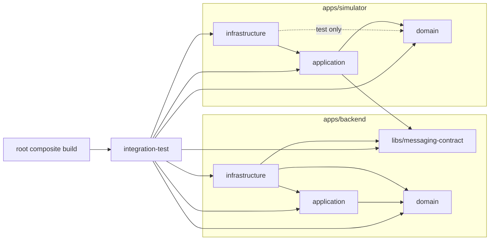
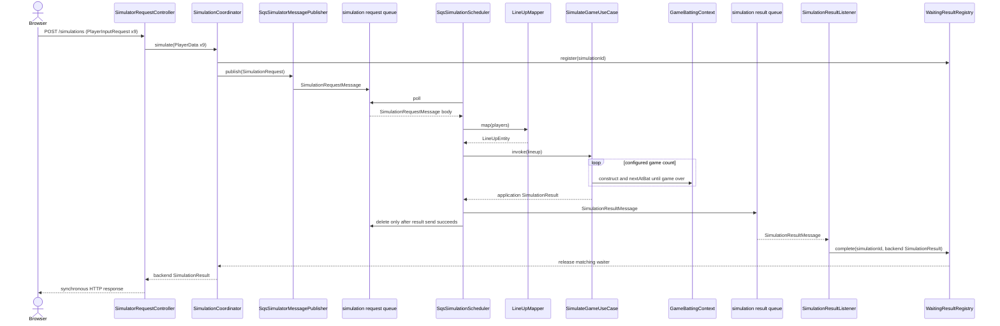

# Implementation navigation map

This is a lightweight starting point for agents and maintainers. Use it to choose
the smallest production path and test set relevant to a change instead of reading
the whole repository. The current source, `settings.gradle`, and module
`build.gradle` files remain authoritative.

For detailed simulator domain diagrams, see `apps/simulator/README.md`. For the
multi-agent delivery workflow and file ownership rules, see
`docs/codex-graph.md`.

## How to use this map

1. Read the root and nearest nested `AGENTS.md`.
2. Select one row from [Change-oriented reading sets](#change-oriented-reading-sets).
3. Read the listed production path and its focused tests.
4. Use `rg` to follow only the symbols or call sites affected by the requested
   behavior.
5. Check an explicitly requested, non-completed feature specification and the
   relevant Gradle files before changing code.

Do not begin with generated sources, `build/`, `.gradle*`, test reports, or all
completed feature specifications. They add context without defining current
production behavior.

## Gradle and module dependencies

The root build is a composite build. It includes the independent Backend and
Simulator builds and owns the cross-application `integration-test` project. Both
application builds include the same physical `libs/messaging-contract` directory.

Arrows point from a consumer to its declared dependency. The dotted Simulator
infrastructure-to-domain edge is test-only.

Boundary summary:

- Backend infrastructure owns HTTP, Thymeleaf, SQS, and composition. Backend
  application coordinates request publication and correlated result waiting.
- Simulator infrastructure owns SQS polling, serialization, and wire mapping.
  Simulator application runs the use case; Simulator domain owns game rules.
- `messaging-contract` contains only the SQS wire types. Backend and Simulator
  internal models remain separate from these records.
- Backend and Simulator do not depend on each other's classes. Their production
  integration is the request and result queues.

## End-to-end execution path

The page itself is served by `SimulationPageController` and
`templates/simulation.html`; its browser script calls the HTTP API above. Spring
composition starts in `BackendApplication` / `InfrastructureConfiguration` and
`SimulatorApplication` / `SimulationInfrastructureConfiguration`.

## Change-oriented reading sets

Paths below are relative to the repository root. Read only the relevant concrete
implementations after the listed entry points identify them.

| Change intent | Start with production code | Focused tests | Stop boundary |
| --- | --- | --- | --- |
| Simulation page, form, or result rendering | [SimulationPageController](../apps/backend/infrastructure/src/main/java/com/example/baseballorders/backend/infrastructure/web/SimulationPageController.java), [simulation.html](../apps/backend/infrastructure/src/main/resources/templates/simulation.html) | [SimulationPageControllerTest](../apps/backend/infrastructure/src/test/java/com/example/baseballorders/backend/infrastructure/web/SimulationPageControllerTest.java), [SimulationPageIntegrationTest](../apps/backend/infrastructure/src/test/java/com/example/baseballorders/backend/infrastructure/web/SimulationPageIntegrationTest.java), [browser test](../apps/backend/infrastructure/src/test/js/simulation.test.mjs) | Do not inspect Simulator rules unless the displayed contract changes. |
| HTTP request mapping, validation, or errors | [PlayerInputRequest](../apps/backend/infrastructure/src/main/java/com/example/baseballorders/backend/infrastructure/api/PlayerInputRequest.java), [SimulatorRequestController](../apps/backend/infrastructure/src/main/java/com/example/baseballorders/backend/infrastructure/api/SimulatorRequestController.java), [SimulationErrorHandler](../apps/backend/infrastructure/src/main/java/com/example/baseballorders/backend/infrastructure/api/SimulationErrorHandler.java) | [SimulatorRequestControllerTest](../apps/backend/infrastructure/src/test/java/com/example/baseballorders/backend/infrastructure/api/SimulatorRequestControllerTest.java), [SimulationErrorHandlerTest](../apps/backend/infrastructure/src/test/java/com/example/baseballorders/backend/infrastructure/api/SimulationErrorHandlerTest.java) | Stop at `SimulationCoordinator` after confirming the application input. |
| Backend request/result coordination | [SimulationCoordinator](../apps/backend/application/src/main/java/com/example/baseballorders/backend/application/SimulationCoordinator.java), [WaitingResultRegistry](../apps/backend/application/src/main/java/com/example/baseballorders/backend/application/WaitingResultRegistry.java), [publisher port](../apps/backend/application/src/main/java/com/example/baseballorders/backend/application/adapter/SimulatorMessagePublisher.java) | [SimulationCoordinatorTest](../apps/backend/infrastructure/src/test/java/com/example/baseballorders/backend/infrastructure/messaging/SimulationCoordinatorTest.java), [WaitingResultRegistryTest](../apps/backend/infrastructure/src/test/java/com/example/baseballorders/backend/infrastructure/messaging/WaitingResultRegistryTest.java), [HTTP integration test](../apps/backend/infrastructure/src/test/java/com/example/baseballorders/backend/infrastructure/web/SimulationResultHttpIntegrationTest.java) | Treat SQS clients and wire conversion as infrastructure. |
| SQS wire contract | [SimulationRequestMessage](../libs/messaging-contract/src/main/java/com/example/baseballorders/messaging/SimulationRequestMessage.java), [SimulationPlayerMessage](../libs/messaging-contract/src/main/java/com/example/baseballorders/messaging/SimulationPlayerMessage.java), [SimulationResultMessage](../libs/messaging-contract/src/main/java/com/example/baseballorders/messaging/SimulationResultMessage.java) | [contract test](../libs/messaging-contract/src/test/java/com/example/baseballorders/messaging/SimulationPlayerMessageTest.java) plus both applications' publisher, listener, and scheduler tests | Do not move application or domain models into the contract. |
| Backend SQS send/receive mapping | [SqsSimulatorMessagePublisher](../apps/backend/infrastructure/src/main/java/com/example/baseballorders/backend/infrastructure/messaging/SqsSimulatorMessagePublisher.java), [SimulationResultListener](../apps/backend/infrastructure/src/main/java/com/example/baseballorders/backend/infrastructure/messaging/SimulationResultListener.java) | [SqsSimulatorMessagePublisherTest](../apps/backend/infrastructure/src/test/java/com/example/baseballorders/backend/infrastructure/messaging/SqsSimulatorMessagePublisherTest.java), [SimulationResultListenerTest](../apps/backend/infrastructure/src/test/java/com/example/baseballorders/backend/infrastructure/messaging/SimulationResultListenerTest.java) | Stop at shared messages on the wire side and application/domain models on the inside. |
| Simulator SQS polling and lineup mapping | [SqsSimulationScheduler](../apps/simulator/infrastructure/src/main/java/com/example/baseballorders/simulator/infrastructure/messaging/SqsSimulationScheduler.java), [LineUpMapper](../apps/simulator/infrastructure/src/main/java/com/example/baseballorders/simulator/infrastructure/messaging/LineUpMapper.java) | [SqsSimulationSchedulerTest](../apps/simulator/infrastructure/src/test/java/com/example/baseballorders/simulator/infrastructure/messaging/SqsSimulationSchedulerTest.java), [SQS integration test](../apps/simulator/infrastructure/src/test/java/com/example/baseballorders/simulator/infrastructure/messaging/SqsSimulationSchedulerIntegrationTest.java), [LineUpMapperTest](../apps/simulator/infrastructure/src/test/java/com/example/baseballorders/simulator/infrastructure/messaging/LineUpMapperTest.java) | Stop after delegation to `SimulateGameUseCase`; business rules belong inward. |
| Simulation count and game orchestration | [SimulateGameUseCase](../apps/simulator/application/src/main/java/com/example/baseballorders/simulator/application/usecase/SimulateGameUseCase.java), [application result](../apps/simulator/application/src/main/java/com/example/baseballorders/simulator/application/contract/SimulationResult.java) | [SimulateGameUseCaseTest](../apps/simulator/application/src/test/java/com/example/baseballorders/simulator/application/SimulateGameUseCaseTest.java) | Read domain internals only for a changed game or aggregation rule. |
| At-bat order, innings, outs, and base transitions | [game package](../apps/simulator/domain/src/main/java/com/example/baseballorders/simulator/domain/game) starting with `GameBattingContext`, `AtBatProcessor`, `AbstractBasesState`, and `BaseStateFactory` | [game tests](../apps/simulator/domain/src/test/java/com/example/baseballorders/simulator/domain/game) starting with `GameBattingContextTest`, `GameStateLifecycleTest`, and `BasesStateTransitionTest` | Read only concrete base states involved in the changed transition. |
| Batting, bunt, steal, or personality behavior | [BatterEntity](../apps/simulator/domain/src/main/java/com/example/baseballorders/simulator/domain/player/BatterEntity.java), [BehaviorStrategies](../apps/simulator/domain/src/main/java/com/example/baseballorders/simulator/domain/player/strategy/BehaviorStrategies.java), then the relevant sealed strategy interface | [BatterEntityTest](../apps/simulator/domain/src/test/java/com/example/baseballorders/simulator/domain/player/BatterEntityTest.java) and the matching [strategy tests](../apps/simulator/domain/src/test/java/com/example/baseballorders/simulator/domain/player/strategy) | Do not inspect unrelated strategy families. |
| Per-game or aggregate statistics | [statistics package](../apps/simulator/domain/src/main/java/com/example/baseballorders/simulator/domain/statistics) starting with `GameStatisticsRecorder`, `ScoreAccumulator`, `GameStatistics`, and `ScoreStatistics` | [GameStatisticsRecorderTest](../apps/simulator/domain/src/test/java/com/example/baseballorders/simulator/domain/statistics/GameStatisticsRecorderTest.java), [ScoreAccumulatorTest](../apps/simulator/domain/src/test/java/com/example/baseballorders/simulator/domain/statistics/ScoreAccumulatorTest.java), plus the caller test for any exposed field | Follow a new field outward only through the application result and wire/backend mappers. |
| Full Backend-to-Simulator communication | The end-to-end path above and [compose.yaml](../compose.yaml) | [BackendSimulatorFlociIntegrationTest](../integration-test/src/test/java/com/example/baseballorders/integration/BackendSimulatorFlociIntegrationTest.java), then [smoke-test.py](../infra/docker/smoke-test.py) when Docker verification is in scope | Use this set only for genuinely cross-application behavior. |

## Domain hotspots

- `GameBattingContext` is the aggregate/facade for batting order and game
  completion. Its `InningStateContext` owns the current inning, inning score,
  current base state, and a configuration-keyed `BasesState` cache; an
  inning-completion callback reflects the completed inning into the game
  aggregate.
- `AtBatProcessor` orders a plate appearance as steal, then bunt, then batting,
  sends updates to `InningStateContext`, and advances the batting order only when
  the plate appearance is consumed.
- `AbstractBasesState` contains common transition mechanics; the eight concrete
  states contain configuration-specific movement. `BaseStateFactory` constructs
  the per-game state set.
- `BatterEntity` delegates decisions to sealed hitting, bunt, and steal strategy
  families. `BehaviorStrategies` is the public factory used at the mapping edge.
- `GameStatisticsRecorder` observes plays within one game. `ScoreAccumulator`
  receives completed games, accumulates all counters in one completion callback,
  and produces aggregate `ScoreStatistics`.

## Keeping the map current

Update this file in the same change when any of the following occurs:

- a module or declared project dependency changes;
- an HTTP, SQS, application, or domain entry point is replaced or moved;
- the request/result flow or delete-after-send behavior changes;
- a new major domain responsibility no longer fits a reading-set row;
- focused tests named here are renamed or removed.

Do not expand this into a generated-source inventory or exhaustive class diagram.
Its value is the small, stable set of entry points. Verify every affected path
against current code before implementation.
