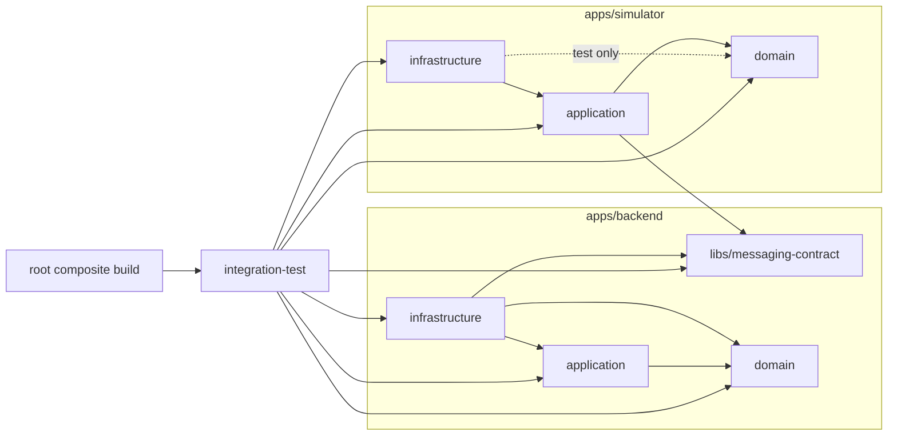
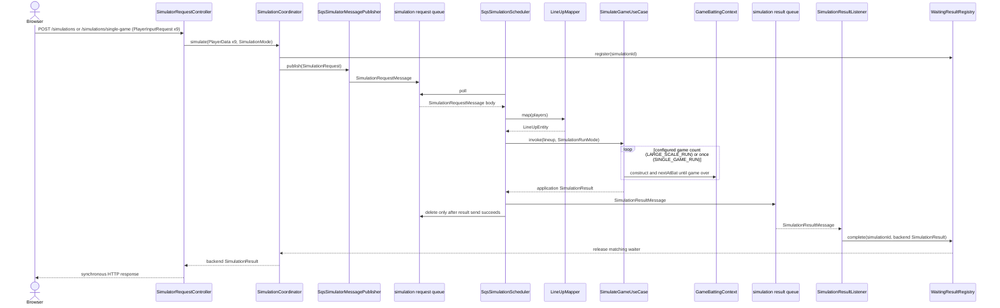

# Implementation navigation map

This is a lightweight starting point for agents and maintainers. Use it to choose
the smallest production path and test set relevant to a change instead of reading
the whole repository. The current source, `settings.gradle`, and module
`build.gradle` files remain authoritative.

For detailed simulator domain diagrams, see `apps/simulator/README.md`. For the
multi-agent delivery workflow and file ownership rules, see
`docs/codex-graph.md`.

## How to use this map

1. Read the root and nearest nested `AGENTS.md`.
2. Select one row from [Change-oriented reading sets](#change-oriented-reading-sets).
3. Read the listed production path and its focused tests.
4. Use `rg` to follow only the symbols or call sites affected by the requested
   behavior.
5. Check an explicitly requested, non-completed feature specification and the
   relevant Gradle files before changing code.

Do not begin with generated sources, `build/`, `.gradle*`, test reports, or all
completed feature specifications. They add context without defining current
production behavior.

## Gradle and module dependencies

The root build is a composite build. It includes the independent Backend and
Simulator builds and owns the cross-application `integration-test` project. Both
application builds include the same physical `libs/messaging-contract` directory.

Arrows point from a consumer to its declared dependency. The dotted Simulator
infrastructure-to-domain edge is test-only.

```mermaid
flowchart LR
    root["root composite build"] --> integration["integration-test"]
    contract["libs/messaging-contract"]

    subgraph backend["apps/backend"]
        bi["infrastructure"] --> ba["application"]
        bi --> bd["domain"]
        ba --> bd
        bi --> contract
    end

    subgraph simulator["apps/simulator"]
        si["infrastructure"] --> sa["application"]
        sa --> sd["domain"]
        sa --> contract
        si -. "test only" .-> sd
    end

    integration --> bi
    integration --> ba
    integration --> bd
    integration --> si
    integration --> sa
    integration --> sd
    integration --> contract
```

Boundary summary:

- Backend infrastructure owns HTTP, Thymeleaf, SQS, and composition. Backend
  application coordinates request publication and correlated result waiting.
- Simulator infrastructure owns SQS polling, serialization, and wire mapping.
  Simulator application runs the use case; Simulator domain owns game rules.
- `messaging-contract` contains only the SQS wire types. Backend and Simulator
  internal models remain separate from these records.
- Backend and Simulator do not depend on each other's classes. Their production
  integration is the request and result queues.

## End-to-end execution path

```mermaid
sequenceDiagram
    actor Browser
    participant API as SimulatorRequestController
    participant Coordinator as SimulationCoordinator
    participant Publisher as SqsSimulatorMessagePublisher
    participant RequestQ as simulation request queue
    participant Scheduler as SqsSimulationScheduler
    participant Mapper as LineUpMapper
    participant UseCase as SimulateGameUseCase
    participant Game as GameBattingContext
    participant ResultQ as simulation result queue
    participant Listener as SimulationResultListener
    participant Registry as WaitingResultRegistry

    Browser->>API: POST /simulations or /simulations/single-game (PlayerInputRequest x9)
    API->>Coordinator: simulate(PlayerData x9, SimulationMode)
    Coordinator->>Registry: register(simulationId)
    Coordinator->>Publisher: publish(SimulationRequest)
    Publisher->>RequestQ: SimulationRequestMessage
    Scheduler->>RequestQ: poll
    RequestQ-->>Scheduler: SimulationRequestMessage body
    Scheduler->>Mapper: map(players)
    Mapper-->>Scheduler: LineUpEntity
    Scheduler->>UseCase: invoke(lineup, SimulationRunMode)
    loop configured game count (LARGE_SCALE_RUN) or once (SINGLE_GAME_RUN)
        UseCase->>Game: construct and nextAtBat until game over
    end
    UseCase-->>Scheduler: application SimulationResult
    Scheduler->>ResultQ: SimulationResultMessage
    Scheduler->>RequestQ: delete only after result send succeeds
    ResultQ-->>Listener: SimulationResultMessage
    Listener->>Registry: complete(simulationId, backend SimulationResult)
    Registry-->>Coordinator: release matching waiter
    Coordinator-->>API: backend SimulationResult
    API-->>Browser: synchronous HTTP response
```

The pages are served by `SimulationPageController`: the default `/` renders
`templates/batting-order.html`, where the user picks one of three teams whose
default lineups (hit average, personality, forced steal/bunt) come from the
backend H2 database (`schema.sql`/`data.sql`, read by
`infrastructure/persistence/JdbcDefaultLineupRepository` through the
`DefaultLineupRepository` port and `DefaultLineupQuery`), reorders batters by
drag (or arrow keys), and changes only non-forced bunt and steal and a
browser-only memo; it reuses `typescript/simulation/` for the large-scale run and
results. Navigation between screens happens only through the shared left menu
(`templates/fragments/site-menu.html`, `static/css/site-menu.css`,
`typescript/site-menu/site-menu.ts`), closed by default, which every screen includes with
its own route as the current page; screens carry no other cross-screen links. `/large-scale` renders
`templates/simulation.html` (`typescript/simulation/`, which posts to
`/simulations`), and `/single-game` renders `templates/single-game.html`
(`typescript/single-game/`, which posts to `/simulations/single-game` and
animates the returned `transitions`). Both pages use
`typescript/lineup/lineup-form.ts` (`LineupForm`), which owns the shared lineup
state, input validation, tab switching, bulk toggles, and the POST request; each
page only passes its messages, endpoint, and result renderer to it.
`#order[data-lineup-mode="reorder"]` switches the shared form to the
drag-and-drop reorder mode. Page scripts are written in TypeScript under
`infrastructure/src/main/typescript` (paths above are relative to
`infrastructure/src/main`) as ES modules grouped by feature: `lineup/`,
`simulation/`, `single-game/`, `site-menu/`, and `shared/` export functions and
classes without touching the page on import, and each template loads exactly one
entry module, `pages/<template>.ts`, that wires them to its DOM. The
`compileTypeScript` Gradle task runs `tsc` with a Gradle-downloaded Node and
serves the output as `/js/**/*.js` (imports written as `.ts` are rewritten to
`.js`), and `testTypeScript` (part of `check`) runs the Node tests in
`src/test/js`: template and CSS checks at the top level, and module behavior
tests under `src/test/js/scripts`, which import the `.ts` sources directly and
use jsdom for the DOM.
`SimulationGuidePageController` serves the
static `/simulation-guide` page. `SimulationMode` in `messaging-contract` selects
the run mode on the wire; a missing mode means `LARGE_SCALE_RUN`. In
`SINGLE_GAME_RUN`, the Simulator records one game's per-play transitions through
`SingleGameTransitionObserver` and `GameTransitionRecorder`. Spring
composition starts in `BackendApplication` / `InfrastructureConfiguration` and
`SimulatorApplication` / `SimulationInfrastructureConfiguration`.

## Change-oriented reading sets

Paths below are relative to the repository root. Read only the relevant concrete
implementations after the listed entry points identify them.

| Change intent | Start with production code | Focused tests | Stop boundary |
| --- | --- | --- | --- |
| Large-scale simulation page, form, or result rendering | [SimulationPageController](../apps/backend/infrastructure/src/main/java/com/example/baseballorders/backend/infrastructure/web/SimulationPageController.java), [simulation.html](../apps/backend/infrastructure/src/main/resources/templates/simulation.html) | [SimulationPageControllerTest](../apps/backend/infrastructure/src/test/java/com/example/baseballorders/backend/infrastructure/web/SimulationPageControllerTest.java), [SimulationPageIntegrationTest](../apps/backend/infrastructure/src/test/java/com/example/baseballorders/backend/infrastructure/web/SimulationPageIntegrationTest.java), [browser test](../apps/backend/infrastructure/src/test/js/simulation.test.mjs) | Do not inspect Simulator rules unless the displayed contract changes. |
| Default batting-order reorder page | [SimulationPageController](../apps/backend/infrastructure/src/main/java/com/example/baseballorders/backend/infrastructure/web/SimulationPageController.java), [batting-order.html](../apps/backend/infrastructure/src/main/resources/templates/batting-order.html), [lineup-form.ts](../apps/backend/infrastructure/src/main/typescript/lineup/lineup-form.ts), [drag-reorder.ts](../apps/backend/infrastructure/src/main/typescript/lineup/drag-reorder.ts), [batting-order.css](../apps/backend/infrastructure/src/main/resources/static/css/batting-order.css) | [SimulationPageControllerTest](../apps/backend/infrastructure/src/test/java/com/example/baseballorders/backend/infrastructure/web/SimulationPageControllerTest.java), [SimulationPageIntegrationTest](../apps/backend/infrastructure/src/test/java/com/example/baseballorders/backend/infrastructure/web/SimulationPageIntegrationTest.java), [browser test](../apps/backend/infrastructure/src/test/js/batting-order.test.mjs) | Results reuse the large-scale renderer in `simulation/`; do not inspect Simulator rules. |
| Team default lineups (H2) | [data.sql](../apps/backend/infrastructure/src/main/resources/data.sql), [schema.sql](../apps/backend/infrastructure/src/main/resources/schema.sql), [JdbcDefaultLineupRepository](../apps/backend/infrastructure/src/main/java/com/example/baseballorders/backend/infrastructure/persistence/JdbcDefaultLineupRepository.java), [DefaultLineupQuery](../apps/backend/application/src/main/java/com/example/baseballorders/backend/application/DefaultLineupQuery.java) | [JdbcDefaultLineupRepositoryTest](../apps/backend/infrastructure/src/test/java/com/example/baseballorders/backend/infrastructure/persistence/JdbcDefaultLineupRepositoryTest.java), [DefaultLineupQueryTest](../apps/backend/application/src/test/java/com/example/baseballorders/backend/application/DefaultLineupQueryTest.java) | Only the reorder page (`/`) uses these defaults; `/large-scale` and `/single-game` keep the defaults in `lineup-form.ts`. |
| Shared left menu (all screen navigation) | [site-menu.html](../apps/backend/infrastructure/src/main/resources/templates/fragments/site-menu.html), [site-menu.css](../apps/backend/infrastructure/src/main/resources/static/css/site-menu.css), [site-menu.ts](../apps/backend/infrastructure/src/main/typescript/site-menu/site-menu.ts) | [SimulationPageIntegrationTest](../apps/backend/infrastructure/src/test/java/com/example/baseballorders/backend/infrastructure/web/SimulationPageIntegrationTest.java), [browser test](../apps/backend/infrastructure/src/test/js/site-menu.test.mjs), [behavior test](../apps/backend/infrastructure/src/test/js/scripts/site-menu/site-menu.test.mjs) | Add a screen by adding a menu item and including the fragment; do not add in-page links between screens. |
| Single-game page, animation, or batting-order table | [SimulationPageController](../apps/backend/infrastructure/src/main/java/com/example/baseballorders/backend/infrastructure/web/SimulationPageController.java), [single-game.html](../apps/backend/infrastructure/src/main/resources/templates/single-game.html), [single-game/](../apps/backend/infrastructure/src/main/typescript/single-game/), [single-game.css](../apps/backend/infrastructure/src/main/resources/static/css/single-game.css) | [SimulationPageControllerTest](../apps/backend/infrastructure/src/test/java/com/example/baseballorders/backend/infrastructure/web/SimulationPageControllerTest.java), [SimulationPageIntegrationTest](../apps/backend/infrastructure/src/test/java/com/example/baseballorders/backend/infrastructure/web/SimulationPageIntegrationTest.java), [browser test](../apps/backend/infrastructure/src/test/js/single-game.test.mjs), [behavior tests](../apps/backend/infrastructure/src/test/js/scripts/single-game/) | Frame durations come from `baseball-orders.rendering.single-game.*`; inspect Simulator transitions only when the displayed transition contract changes. |
| Lineup input shared by both pages (defaults, validation, tabs, bulk toggles, submit) | [lineup/](../apps/backend/infrastructure/src/main/typescript/lineup/) | [behavior tests](../apps/backend/infrastructure/src/test/js/scripts/lineup/), [simulation.test.mjs](../apps/backend/infrastructure/src/test/js/simulation.test.mjs), [single-game.test.mjs](../apps/backend/infrastructure/src/test/js/single-game.test.mjs), [SimulationPageIntegrationTest](../apps/backend/infrastructure/src/test/java/com/example/baseballorders/backend/infrastructure/web/SimulationPageIntegrationTest.java) | Keep page-specific messages, endpoints, and result rendering in `simulation/` and `single-game/`. |
| HTTP request mapping, validation, or errors | [PlayerInputRequest](../apps/backend/infrastructure/src/main/java/com/example/baseballorders/backend/infrastructure/api/PlayerInputRequest.java), [SimulatorRequestController](../apps/backend/infrastructure/src/main/java/com/example/baseballorders/backend/infrastructure/api/SimulatorRequestController.java), [SimulationErrorHandler](../apps/backend/infrastructure/src/main/java/com/example/baseballorders/backend/infrastructure/api/SimulationErrorHandler.java) | [SimulatorRequestControllerTest](../apps/backend/infrastructure/src/test/java/com/example/baseballorders/backend/infrastructure/api/SimulatorRequestControllerTest.java), [SimulationErrorHandlerTest](../apps/backend/infrastructure/src/test/java/com/example/baseballorders/backend/infrastructure/api/SimulationErrorHandlerTest.java) | Stop at `SimulationCoordinator` after confirming the application input. |
| Backend request/result coordination | [SimulationCoordinator](../apps/backend/application/src/main/java/com/example/baseballorders/backend/application/SimulationCoordinator.java), [WaitingResultRegistry](../apps/backend/application/src/main/java/com/example/baseballorders/backend/application/WaitingResultRegistry.java), [publisher port](../apps/backend/application/src/main/java/com/example/baseballorders/backend/application/adapter/SimulatorMessagePublisher.java) | [SimulationCoordinatorTest](../apps/backend/infrastructure/src/test/java/com/example/baseballorders/backend/infrastructure/messaging/SimulationCoordinatorTest.java), [WaitingResultRegistryTest](../apps/backend/infrastructure/src/test/java/com/example/baseballorders/backend/infrastructure/messaging/WaitingResultRegistryTest.java), [HTTP integration test](../apps/backend/infrastructure/src/test/java/com/example/baseballorders/backend/infrastructure/web/SimulationResultHttpIntegrationTest.java) | Treat SQS clients and wire conversion as infrastructure. |
| SQS wire contract | [SimulationRequestMessage](../libs/messaging-contract/src/main/java/com/example/baseballorders/messaging/SimulationRequestMessage.java), [SimulationPlayerMessage](../libs/messaging-contract/src/main/java/com/example/baseballorders/messaging/SimulationPlayerMessage.java), [SimulationResultMessage](../libs/messaging-contract/src/main/java/com/example/baseballorders/messaging/SimulationResultMessage.java), [SimulationMode](../libs/messaging-contract/src/main/java/com/example/baseballorders/messaging/SimulationMode.java) | [contract test](../libs/messaging-contract/src/test/java/com/example/baseballorders/messaging/SimulationPlayerMessageTest.java) plus both applications' publisher, listener, and scheduler tests | Do not move application or domain models into the contract. |
| Backend SQS send/receive mapping | [SqsSimulatorMessagePublisher](../apps/backend/infrastructure/src/main/java/com/example/baseballorders/backend/infrastructure/messaging/SqsSimulatorMessagePublisher.java), [SimulationResultListener](../apps/backend/infrastructure/src/main/java/com/example/baseballorders/backend/infrastructure/messaging/SimulationResultListener.java) | [SqsSimulatorMessagePublisherTest](../apps/backend/infrastructure/src/test/java/com/example/baseballorders/backend/infrastructure/messaging/SqsSimulatorMessagePublisherTest.java), [SimulationResultListenerTest](../apps/backend/infrastructure/src/test/java/com/example/baseballorders/backend/infrastructure/messaging/SimulationResultListenerTest.java) | Stop at shared messages on the wire side and application/domain models on the inside. |
| Simulator SQS polling and lineup mapping | [SqsSimulationScheduler](../apps/simulator/infrastructure/src/main/java/com/example/baseballorders/simulator/infrastructure/messaging/SqsSimulationScheduler.java), [LineUpMapper](../apps/simulator/infrastructure/src/main/java/com/example/baseballorders/simulator/infrastructure/messaging/LineUpMapper.java) | [SqsSimulationSchedulerTest](../apps/simulator/infrastructure/src/test/java/com/example/baseballorders/simulator/infrastructure/messaging/SqsSimulationSchedulerTest.java), [SQS integration test](../apps/simulator/infrastructure/src/test/java/com/example/baseballorders/simulator/infrastructure/messaging/SqsSimulationSchedulerIntegrationTest.java), [LineUpMapperTest](../apps/simulator/infrastructure/src/test/java/com/example/baseballorders/simulator/infrastructure/messaging/LineUpMapperTest.java) | Stop after delegation to `SimulateGameUseCase`; business rules belong inward. |
| Simulation count, run mode, and game orchestration | [SimulateGameUseCase](../apps/simulator/application/src/main/java/com/example/baseballorders/simulator/application/usecase/SimulateGameUseCase.java), [application result](../apps/simulator/application/src/main/java/com/example/baseballorders/simulator/application/contract/SimulationResult.java) | [SimulateGameUseCaseTest](../apps/simulator/application/src/test/java/com/example/baseballorders/simulator/application/SimulateGameUseCaseTest.java), [SimulateGameUseCaseSingleGameScenarioTest](../apps/simulator/application/src/test/java/com/example/baseballorders/simulator/application/SimulateGameUseCaseSingleGameScenarioTest.java) | Read domain internals only for a changed game or aggregation rule. |
| At-bat order, innings, outs, and base transitions | [game package](../apps/simulator/domain/src/main/java/com/example/baseballorders/simulator/domain/game) starting with `GameBattingContext`, `AtBatProcessor`, `AbstractBasesState`, and `BaseStateFactory` | [game tests](../apps/simulator/domain/src/test/java/com/example/baseballorders/simulator/domain/game) starting with `GameBattingContextTest`, `GameStateLifecycleTest`, and `BasesStateTransitionTest` | Read only concrete base states involved in the changed transition. |
| Batting, bunt, steal, or personality behavior | [BatterEntity](../apps/simulator/domain/src/main/java/com/example/baseballorders/simulator/domain/player/BatterEntity.java), [BehaviorStrategies](../apps/simulator/domain/src/main/java/com/example/baseballorders/simulator/domain/player/strategy/BehaviorStrategies.java), then the relevant sealed strategy interface | [BatterEntityTest](../apps/simulator/domain/src/test/java/com/example/baseballorders/simulator/domain/player/BatterEntityTest.java) and the matching [strategy tests](../apps/simulator/domain/src/test/java/com/example/baseballorders/simulator/domain/player/strategy) | Do not inspect unrelated strategy families. |
| Per-game or aggregate statistics | [statistics package](../apps/simulator/domain/src/main/java/com/example/baseballorders/simulator/domain/statistics) starting with `GameStatisticsRecorder`, `ScoreAccumulator`, `GameStatistics`, and `ScoreStatistics` | [GameStatisticsRecorderTest](../apps/simulator/domain/src/test/java/com/example/baseballorders/simulator/domain/statistics/GameStatisticsRecorderTest.java), [ScoreAccumulatorTest](../apps/simulator/domain/src/test/java/com/example/baseballorders/simulator/domain/statistics/ScoreAccumulatorTest.java), plus the caller test for any exposed field | Follow a new field outward only through the application result and wire/backend mappers. |
| Full Backend-to-Simulator communication | The end-to-end path above and [compose.yaml](../compose.yaml) | [BackendSimulatorFlociIntegrationTest](../integration-test/src/test/java/com/example/baseballorders/integration/BackendSimulatorFlociIntegrationTest.java), then [smoke-test.py](../infra/docker/smoke-test.py) when Docker verification is in scope | Use this set only for genuinely cross-application behavior. |

## Domain hotspots

- `GameBattingContext` is the aggregate/facade for batting order and game
  completion. Its `InningStateContext` owns the current inning, inning score,
  current base state, and a configuration-keyed `BasesState` cache; an
  inning-completion callback reflects the completed inning into the game
  aggregate.
- `AtBatProcessor` orders a plate appearance as steal, then bunt, then batting,
  sends updates to `InningStateContext`, and advances the batting order only when
  the plate appearance is consumed.
- `AbstractBasesState` contains common transition mechanics; the eight concrete
  states contain configuration-specific movement. `BaseStateFactory` constructs
  the per-game state set.
- `BatterEntity` delegates decisions to sealed hitting, bunt, and steal strategy
  families. `BehaviorStrategies` is the public factory used at the mapping edge.
- `GameStatisticsRecorder` observes plays within one game. `ScoreAccumulator`
  receives completed games, accumulates all counters in one completion callback,
  and produces aggregate `ScoreStatistics`.
- `domain.rule` holds the tunable probabilities as value objects without
  defaults. `SimulationRuleProperties` binds `simulation.rule.*` and
  `SimulationPitcherProperties` binds `simulation.pitcher.*` in the Simulator
  infrastructure; they reach `BehaviorStrategies`, `BaseStateFactory`, and
  `LineUpMapper` through constructors.

## Keeping the map current

Update this file in the same change when any of the following occurs:

- a module or declared project dependency changes;
- an HTTP, SQS, application, or domain entry point is replaced or moved;
- the request/result flow or delete-after-send behavior changes;
- a new major domain responsibility no longer fits a reading-set row;
- focused tests named here are renamed or removed.

Do not expand this into a generated-source inventory or exhaustive class diagram.
Its value is the small, stable set of entry points. Verify every affected path
against current code before implementation.
