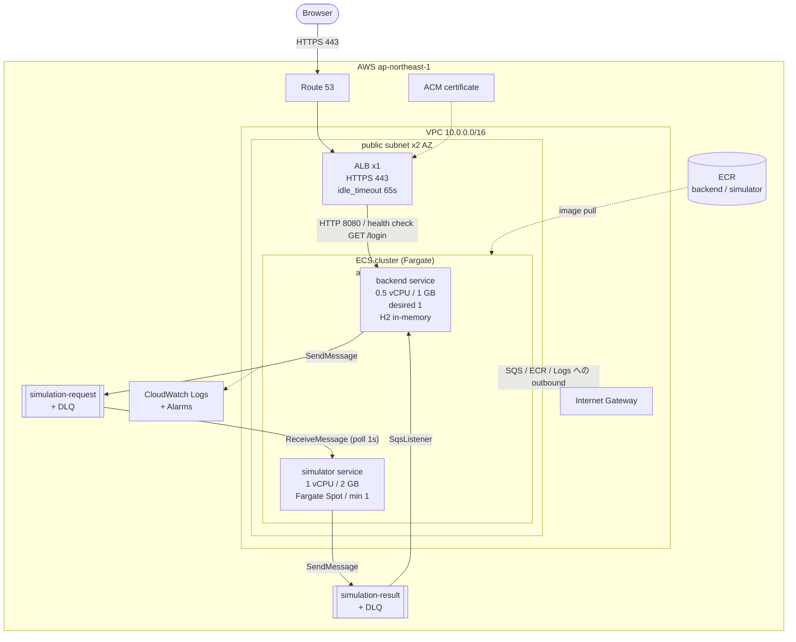

# AWS デプロイ構成（低コスト版・NAT Gateway 不使用）

[aws-deployment.md](aws-deployment.md) の標準構成から **NAT Gateway を取り除いた** 代替構成をまとめる。
前提・アプリケーション側の制約・本番公開前対応・デプロイ手順は標準構成と同一であるため、この文書では
差分（ネットワーク構成とコスト）のみを扱う。共通部分は都度 [aws-deployment.md](aws-deployment.md) を参照すること。

適用条件は同じ：

- **Google SSO を使わない構成**（`GOOGLE_CLIENT_ID` / `GOOGLE_CLIENT_SECRET` 未設定）。
- **RDBMS を使わない構成**（[永続化の前提](aws-deployment.md#永続化の前提)が成り立つ場合のみ）。

## 標準構成との違い

標準構成は private subnet の ECS タスクが NAT Gateway 経由で SQS・ECR・CloudWatch Logs・
（Google SSO 有効時は）`accounts.google.com` へ outbound する。この文書の構成は private subnet と
NAT Gateway を廃止し、**ECS タスクを public subnet に置いてパブリック IP から直接 outbound する**。
[NAT Gateway の代替](aws-deployment.md#nat-gateway-の代替)の比較表で挙げた 3 択のうち、最も安価な
「public subnet + パブリック IP、inbound は SG で全遮断」を採用したものが本構成である。

## 構成図

図の読み方で誤解しやすい点を補足する。

- **private subnet が存在しない**。ECS タスクは ALB と同じ public subnet 上にあり、各タスクに
  パブリック IP（`assign_public_ip = true`）が割り当たる。outbound は NAT Gateway ではなく
  Internet Gateway を直接経由する。
- **inbound は Security Group で全遮断する**。パブリック IP を持つことと、外部から到達できることは
  別である。ECS タスク用 SG の ingress は ALB SG からの `tcp/8080` のみを許可し、それ以外の inbound は
  一切許可しない。egress は SQS・ECR・CloudWatch Logs（および Google SSO 有効時は
  `accounts.google.com`）向けに `0.0.0.0/0` を許可する。
- **ALB の設定・タスク定義の環境変数・SQS まわりの制約は標準構成と同一**。
  [ALB の設定値](aws-deployment.md#alb-の設定値)、[タスク定義の環境変数](aws-deployment.md#タスク定義の環境変数)、
  [この構成が受け入れている制約](aws-deployment.md#この構成が受け入れている制約)をそのまま参照すること。

## リソース構成（差分）

`infra/aws-terraform/` に追加するファイルは標準構成と同じ一覧だが、内容が以下のように変わる。

| ファイル | 標準構成との差分 |
| --- | --- |
| `network.tf` | private subnet・NAT Gateway・NAT 用 Elastic IP を作成しない。public subnet x2 AZ・IGW・SG 3 種のみ。ECS タスク用 SG は ALB SG からの `8080` のみ ingress 許可、egress は `0.0.0.0/0` |
| `ecs.tf` | service の `network_configuration` で `subnets` に public subnet を指定し、`assign_public_ip = true` を設定する。それ以外（cluster・task definition・service 定義）は標準構成と同一 |

`alb.tf`・`ecr.tf`・`iam.tf`・`autoscaling.tf`・`observability.tf` は標準構成のまま変更なし。
`rds.tf` を追加しない前提も同一。

## この構成で失われるもの・許容している前提

- **ECS タスクが直接インターネットに公開される経路を持つ**。inbound は SG で塞いでいるため到達性は
  ALB 経由のみに保たれるが、防御の層は NAT Gateway 構成（private subnet + SG）より 1 枚少ない
  （SG の設定ミスがそのまま外部到達性の欠如に直結する）。SG のルールは Terraform で管理し、
  レビュー無しでの変更を避けること。
- **タスクごとにパブリック IP を消費する**（ENI 課金は発生しないが、VPC のパブリック IP 枯渇や
  IP ベースの外部許可リスト運用とは相性が悪い）。
- NAT Gateway を将来追加する場合は private subnet の作成が前提になるため、`network.tf` と
  `ecs.tf` の `network_configuration` を標準構成の内容に戻す形で移行する。

## 費用の目安

ap-northeast-1、月額の概算（[aws-deployment.md の費用の目安](aws-deployment.md#費用の目安)の
「コスト最適化」列と同じ内訳）。

| 項目 | 金額 |
| --- | --- |
| ALB | $20 |
| Fargate backend (0.5 vCPU / 1 GB 常時) | $18 |
| Fargate simulator (1 vCPU / 2 GB 常時、Spot) | $11 |
| NAT Gateway | $0（不使用） |
| SQS / CloudWatch Logs / ECR | $2 |
| 合計 | 約 $51 |

さらに下げる場合、EC2 1 台に既存の `compose.yaml` をそのまま載せる選択肢がある（月 $12〜15、
[aws-deployment.md](aws-deployment.md#費用の目安)を参照）。backend が 1 タスク固定である制約は
本構成でも同じであるため、機能面の損失はほぼ無く、サービス単位のスケール・無停止デプロイ・
AZ 冗長を必要とするかどうかが判断基準になる。

## この文書の更新条件

- [aws-deployment.md](aws-deployment.md) の「この文書の更新条件」に該当する変更をしたとき
- ECS タスク用 SG の ingress/egress ルールを変更したとき
- NAT Gateway を導入し private subnet 構成に戻したとき（この文書を廃止するか、その旨を明記する）
