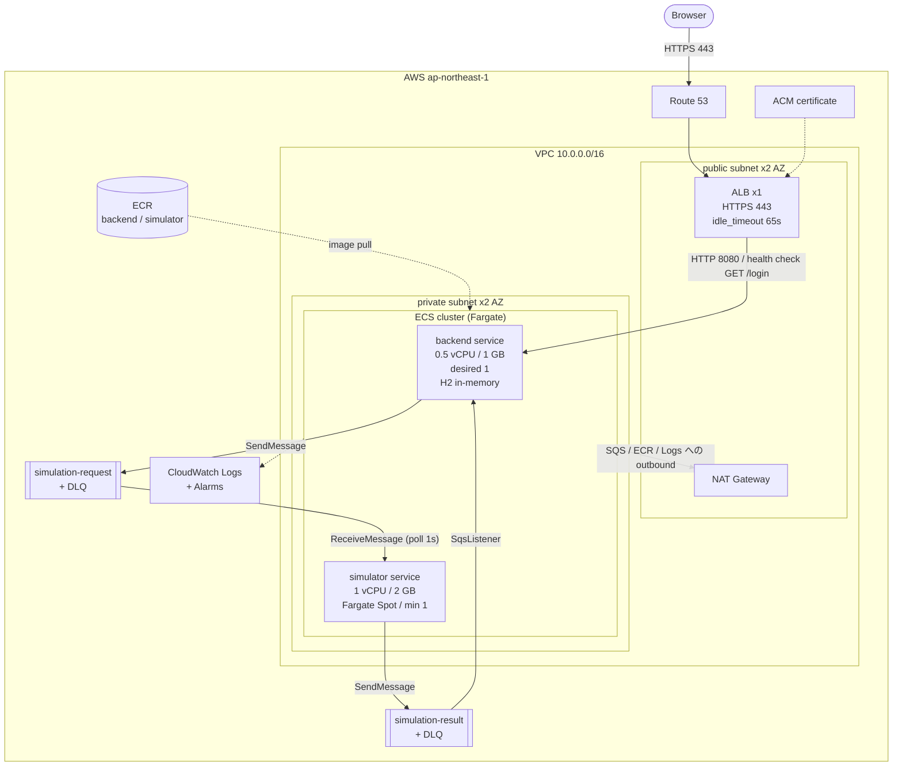

# AWS デプロイ構成

`apps/backend` と `apps/simulator` を AWS に配置するための構成図と、その構成を決めた根拠をまとめる。
アプリケーション内部の実行経路は [architecture.md](architecture.md) を参照すること。

前提:

- **Google SSO を使わない構成**。認証はローカル登録（`/register`）のフォームログインのみ。
  `GOOGLE_CLIENT_ID` / `GOOGLE_CLIENT_SECRET` を渡さなければ `GoogleOAuthProperties.enabled()` が
  false になり、`SecurityConfiguration` は OAuth ログインを登録しないため、コード変更は不要。
- **RDBMS を使わない構成**（backend は H2 インメモリのまま）。この前提が成り立つ条件は
  [永続化の前提](#永続化の前提) に記載する。

## 構成図



SQS を挟んだ 1 リクエストの流れは同期的で、`SimulationCoordinator` が **30 秒**まで
HTTP スレッドをブロックして結果を待つ。この 30 秒がタイムアウト系の設定値すべての基準になる。

図の読み方で誤解しやすい点を 3 つ補足する。

- **ALB は 1 台**である。`public subnet x2 AZ` は ALB が 2 台あるという意味ではなく、1 つの ALB が
  2 つの AZ にまたがって配置されていることを示す。ALB は作成時に異なる 2 AZ のサブネットを最低 2 つ
  要求するため、この x2 は削減できない。削減できるのは ECS タスク側の AZ 数である。
- **SQS・ECR・CloudWatch Logs は VPC の外にある**。同じ `AWS ap-northeast-1` の枠内に描いているのは
  同一リージョンのマネージドサービスであることを示すためで、VPC の内側にいるわけではない。
  private subnet からこれらを呼ぶには外向きの経路が必要で、それが NAT Gateway である。
  `backend --> simulation-request` などの矢印は論理的なメッセージの流れを表し、
  実際の通信経路は NAT Gateway を経由する。
- **Google SSO を外しても NAT Gateway は不要にならない**。上記の通り SQS・ECR・Logs への outbound が
  残るため。NAT を無くす選択肢は [NAT Gateway の代替](#nat-gateway-の代替) を参照。

### NAT Gateway の代替

| 方法 | 月額 | 評価 |
| --- | --- | --- |
| NAT Gateway | 約 $35 | private subnet を維持でき、経路の説明が最も単純 |
| VPC エンドポイント（ECR api / ECR dkr / Logs / SQS の interface 4 種 + S3 gateway） | 約 $41〜82 | interface 型は 1 種あたり 1 AZ で月 $10 前後。この規模では NAT より高い |
| public subnet + パブリック IP、inbound は SG で全遮断 | $0 | private subnet が無くなる代わりに最も安い |

この規模では VPC エンドポイントは割に合わない。NAT を維持するか、全タスクを public subnet に置くかの
二択になる。

## リソース構成

`infra/aws-terraform/` に追加するファイル単位で示す。既存の `sqs.tf`（キュー・DLQ・IAM ポリシー）は
そのまま利用し、その `backend_sqs_policy_arn` / `simulator_sqs_policy_arn` output を新しいタスクロールに attach する。

| ファイル | 内容 |
| --- | --- |
| `network.tf` | VPC、public/private subnet x2 AZ、IGW、NAT Gateway、SG 3 種（alb / backend / simulator） |
| `ecr.tf` | repository x2、lifecycle policy（untagged 7 日・直近 30 イメージ）、イメージスキャン |
| `alb.tf` | ALB、ACM、HTTPS listener、HTTP→HTTPS リダイレクト、target group |
| `ecs.tf` | cluster（FARGATE + FARGATE_SPOT）、task definition x2、service x2 |
| `iam.tf` | task execution role（ECR pull / Logs / `ssm:GetParameters`）、task role x2 |
| `autoscaling.tf` | simulator を `ApproximateNumberOfMessagesVisible` で 1→N にスケール |
| `observability.tf` | ロググループ x2（保持 14 日）、アラーム |

RDBMS を使わないため、`rds.tf`・DB サブネットグループ・DB 用 SG・`DATABASE_*` の秘匿値管理は存在しない。

### ALB の設定値

| 設定 | 値 | 根拠 |
| --- | --- | --- |
| health check path | `GET /login` | `SecurityConfiguration` で `permitAll` されている数少ないパス。`/` は `authenticated()` のため 302 を返す |
| `idle_timeout` | 65 秒 | 待機 30 秒 + アプリ処理に余裕を持たせる。既定 60 秒でも計算上は足りるが、境界に依存させない |
| `deregistration_delay` | 35 秒 | デプロイ時に待機中の 30 秒リクエストを落とさない |

### タスク定義の環境変数

| 変数 | backend | simulator | 供給元 |
| --- | --- | --- | --- |
| `SPRING_PROFILES_ACTIVE` | `prod` | `prod` | task definition |
| `SIMULATION_REQUEST_QUEUE_NAME` | 必要 | 必要 | Terraform output |
| `SIMULATION_RESULT_QUEUE_NAME` | 必要 | 必要 | Terraform output |
| `SIMULATION_SQS_POLL_FIXED_DELAY` | — | `1s` | task definition |
| `GOOGLE_CLIENT_ID` / `GOOGLE_CLIENT_SECRET` | 必要 | — | SSM Parameter Store（SecureString） |

秘匿値は Secrets Manager ではなく SSM Parameter Store の SecureString を使う。保存する値が 2 つだけで、
Parameter Store は標準パラメータが無料であるため。

## 永続化の前提

JPA エンティティは `UserAccountEntity` の 1 つだけで、永続化対象は `users` テーブルに限られる。
**シミュレーション結果は DB に保存されない**（SQS で往復し HTTP レスポンスで返すだけ）。

このため H2 インメモリでもタスク再起動時の影響はログイン手段によって分かれる。

| ログイン手段 | タスク再起動後の挙動 |
| --- | --- |
| Google OAuth | `GoogleOidcUserProvisioningService` が次回ログイン時に subject から再作成するため影響なし |
| ローカル登録（`/register`） | `users` が空になり、登録済みアカウントでログインできなくなる |

したがって **Google ログインのみを本番の認証手段とする限り、RDBMS は不要**である。
次のいずれかが要件になった時点で RDS PostgreSQL（`V1__create_users.sql` が
`BIGINT GENERATED BY DEFAULT AS IDENTITY` を使うため PostgreSQL 10+ が前提、MySQL は不可）を追加し、
`org.postgresql:postgresql` を `apps/backend/infrastructure/build.gradle` に足す。

1. ローカル登録アカウントを再起動後も保持する
2. backend を 2 タスク以上で動かす（タスクごとに別の `users` テーブルを持つため、ローカルログインが
   到達したタスク次第で成否が変わる）

H2 のファイルモードを EFS に置く中間解は採らない。H2 のファイルロックは NFS 上で信頼できず、
単一タスク限定という制約も解消しないため。

## この構成が受け入れている制約

構成図の `desired 1` や `poll 1s` はアプリケーション側の現在の実装から決まっている。

- **backend は 1 タスク固定**。`simulation-result` は共有の標準キューであり、どのタスクが受信するかは不定。
  一方 `WaitingResultRegistry` はタスクローカルな `ConcurrentHashMap` のため、2 タスク以上にすると
  待機していないタスクに結果が届き、送信元は 30 秒でタイムアウトする。HttpSession もインメモリのため、
  多重化する場合は ALB のスティッキーセッションだけでは足りない。
  恒久対応は結果を永続化して画面を `GET /simulations/{id}` のポーリングに変更する方向が最も素直で、
  同期 HTTP 保持そのものを無くせる。別の feature specification として扱う。
- **simulator の最小タスク数は 1**。キュー長によるスケールアウトは 0→1 の起動に 1〜2 分かかり、
  backend の 30 秒タイムアウトに間に合わない。常時費用は Fargate Spot で抑える。
  `SqsSimulationScheduler` は結果送信が成功してから要求メッセージを削除するため、
  Spot の中断で処理中のメッセージが失われることはなく再配信される。
- **`SIMULATION_SQS_POLL_FIXED_DELAY` の明示指定が必須**。`application-prod.yml` の既定は 60 秒で、
  backend の待機 30 秒を超える。未指定のまま本番に出すと高確率でタイムアウトする。
- **visibility timeout と 1 ポーリングの処理時間の関係**。`max-messages-per-poll: 10` を逐次処理する一方で
  キューの `visibility_timeout_seconds` は 60。10 件の処理が 60 秒を超えると再配信され二重実行になる。
  `max-messages-per-poll` を下げるか visibility timeout を上げるかの判断が要る。
- **backend は起動時にインターネットへの outbound が必要**。`SecurityConfiguration` が
  `ClientRegistrations.fromIssuerLocation("https://accounts.google.com")` を呼ぶ。
  VPC エンドポイントでは代替できないため、NAT Gateway か public subnet + パブリック IP のいずれかが必須。

## 本番公開前に必要なアプリケーション側の対応

- `V4__seed_default_local_user.sql` が既知の bcrypt ハッシュを持つ `local:test` を投入する。
  H2 インメモリでは起動のたびに再投入されるため削除では対処できない。Flyway の `locations` を
  プロファイルで分け、prod では実行しないようにする。
- `application-prod.yml` の `same-site: strict` は、Google からのリダイレクト（クロスサイトの
  トップレベル遷移）でセッション Cookie が送られず OAuth ログインが失敗する。`lax` にする。
- ALB 配下では `server.forward-headers-strategy: framework` が無いと Spring が `http://` の
  redirect_uri を生成し、Google 側に登録した URI と一致しない。
- Google Cloud 側に `https://<ホスト名>/login/oauth2/code/google` をリダイレクト URI として登録する。

## デプロイ

`.github/workflows/release-ecr.yml` が release 公開時に `APP` build-arg で 2 イメージを ECR へ push 済み。
その後段に ECS へのデプロイジョブを追加する。

```text
release published
  -> build & push <repository>:<tag>          (既存)
  -> aws ecs register-task-definition          (image のみ差し替え)
  -> aws ecs update-service --force-new-deployment
```

Terraform 側の task definition には `lifecycle { ignore_changes = [container_definitions] }` を設定し、
インフラ（Terraform）とイメージタグ（CD）の所有者を分離する。分離しないと release のたびに
`plan-terraform-deployment.yml` の plan に差分が出る。

## 費用の目安

ap-northeast-1、月額の概算。

| 項目 | 標準 | コスト最適化 |
| --- | --- | --- |
| ALB | $20 | $20 |
| Fargate backend (0.5 vCPU / 1 GB 常時) | $18 | $18 |
| Fargate simulator (1 vCPU / 2 GB 常時) | $36 | $11（Spot） |
| NAT Gateway | $35 | $0（public subnet + パブリック IP、inbound は SG で遮断） |
| SQS / CloudWatch Logs / ECR | $2 | $2 |
| 合計 | 約 $111 | 約 $51 |

さらに下げる場合、EC2 1 台に既存の `compose.yaml` をそのまま載せる選択肢がある（月 $12〜15）。
backend が 1 タスク固定である制約は同じなので機能面の損失はほぼ無く、サービス単位のスケール、
無停止デプロイ、AZ 冗長を必要とするかどうかが判断基準になる。

## この文書の更新条件

- ECS サービス構成、ネットワーク、キューのパラメータを変更したとき
- backend の待機時間、simulator のポーリング間隔、visibility timeout のいずれかを変更したとき
- 永続化要件が変わり RDBMS を追加したとき
- 上記「本番公開前に必要なアプリケーション側の対応」を解消したとき（該当項目を削除する）
